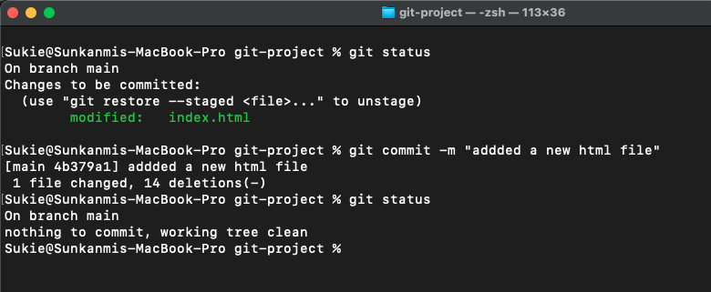
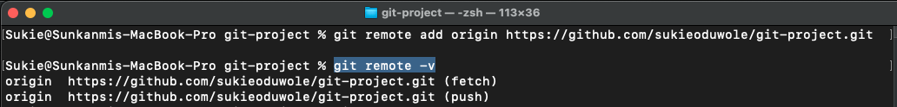
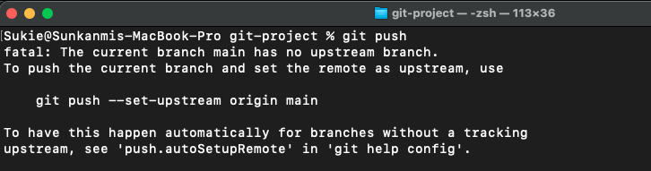
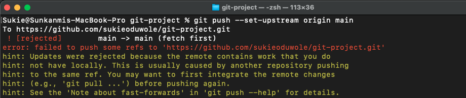
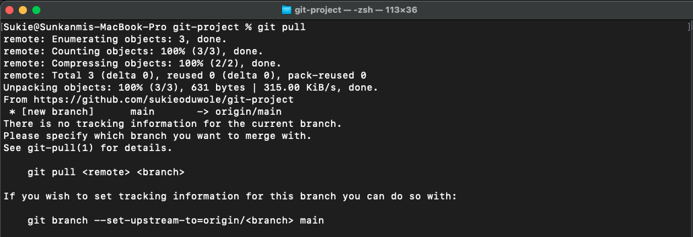
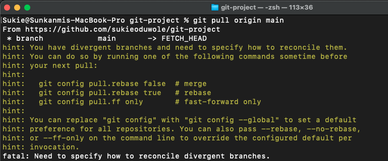
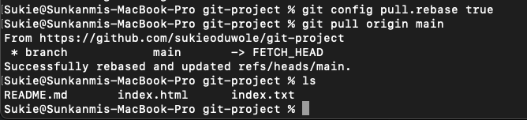
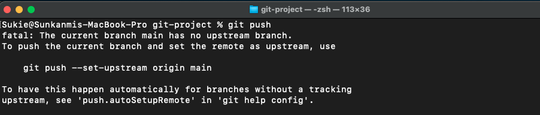
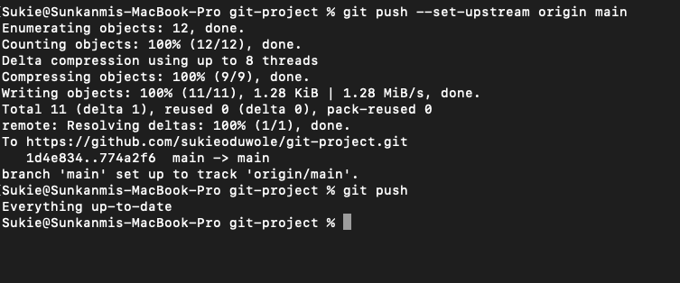
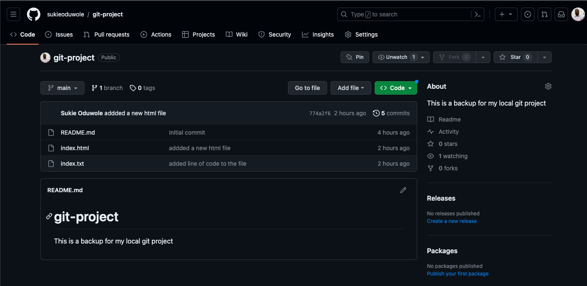

# Git Pratice Documentation

- Committed all chages on the local repository using:
`git commit -m ""added a new html file"`

- Connected the local repo to the remote repo on github using:
`git remote add origin https://github.com/sukieoduwole/git-project.git` 

    Used `git remote -v` to confirm or check if there's any remote repository is linked with the local repository.

- Pushed the local repository to the remote repo using: `git push` an error flagged off but suggested to set-upstream origin main

- Set the upstream origing using:
`git push --set-upstream origin main` and got another error saying 
    > failed to push some refs to 'https://github.com/sukieoduwole/git-project.git'

    

- Did a `git pull` as sugessted by the message from the above error

    The error I got after doing a pull suggested I do a `git pull <remote> <branch>` and I used `git pull origin main` got a messasge saying 
    > Need to specify how to reconcile divergent branches.

    

    Used `git config pull.rebase true` to reconcile divergent branches. 
    
    This seems to solve the errors as I was able to pull the remote repo to my local repo just for me to have a consistent repo with the remote repo just for me to be able to push my local repo.

- Got an message asking to set-upstream again

- Set-upstream once again using the `git push -set-upstream origin main` as suggested in the message.

Finally I was able to push this local reposistory to my Github

