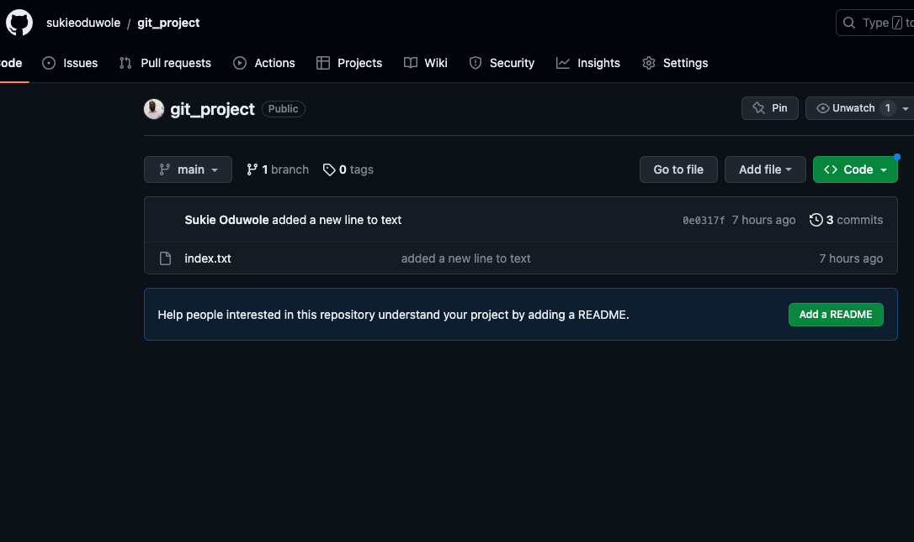

## Git Practice Project

In this project I practiced with some Git commands. I was able to create a directory on my local system, initialised it to a Git repository. I made my first commit and also worked with branches. Merged my branch to the main branch. I also created a remote repository, pushed my local repository to the remote repo. Lastly, I was able to clone my remote repo to my local system.

Created a Devops directory and initalised it

Created a text, I tracked it using the git add . command. Made a commit using the git commit -m 

Created a branch using git checkout -b newbranch and also listed the branches with git branch

Here I made changes to the text in the index.txt. I tracked it using "git add ." I commited the changes using "git commit -m". To merge the changes to the main branch, I made a switch back to the main branch using the "git checkout main" and merge the branch to the main using the "git merge newbranch"

I used the "git branch -d <branchname>" to delete the branch I created earlier

Pushed my local repository to my remote repository using the "git remote add origin remote repository link and also with the "git push origin main"

Here is what my remote repository looks like on GitHub

Finally, I cloned my remote repo to my local machine using the "git clone remote repository link" 

