# DevOps Tooling Website Solution
## Implementing a business website using NFS for backend file storage

In the previous project of [Implementing Wordpress Website with LVM Storage Management](https://github.com/sukieoduwole/my_darey.io_projects/blob/main/project9_WordPress_with_LVM_storage/readme.md), I implemented a WordPress based solution that is ready to be filled with content and can be used as a full fledged website or blog. Moving further, I will be adding some more value to the solution that a DevOps team could utilize.  

In this project, I implemented a tooling website which makes access to DevOps tools within the corporate infrastructure easily accessible.

## Prerequisite
Knowledge of:
- [Network-attached storage (NAS)](https://en.wikipedia.org/wiki/Network-attached_storage)
- [Storage area network](https://en.wikipedia.org/wiki/Storage_area_network)
- [Block-level storage](https://en.wikipedia.org/wiki/Block-level_storage)
- [Object storage](https://en.wikipedia.org/wiki/Object_storage)
- [Difference Between Block, Object, and File Storage](https://aws.amazon.com/compare/the-difference-between-block-file-object-storage/)
- [Logical Volume Manager (LVM)](https://en.wikipedia.org/wiki/Logical_Volume_Manager_(Linux))

### Setup and Technologies
In this project I implemented a solution that consists of the following components:

- Infrastructure: AWS
- Webserver: RedHat Enterprise Linux 9
- Database Server: Ubuntu 22.04 + MySQL
- Storage Server: RedHat Enterprise Linux 9 + NFS Server
- Programming Language: PHP
- Code Repository: GitHub

Side Note

### Architecture
In the architecture below, different webservers share a common database and also accessing the same files using [Network File System](https://en.wikipedia.org/wiki/Network_File_System) as a shared file storage. 

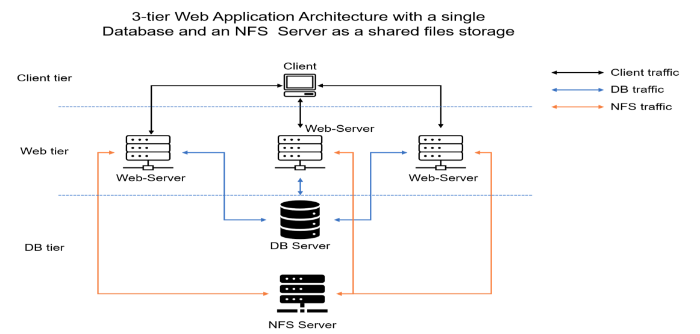

*Note:* Even though the NFS server might be located on a completely separated hardware, for the webservers it looks like a local file system from where they can server the same files.

*Side Note:* In order to know what storage is suitable for what use cases, the following questions must be answered:

- What data will be stored?
- In what format is the data?
- How this data will be accessed?
- By whom, from where and how frequent?

The answers will guide choosing the right storage system for the intended solution.

## Implementation
### Step 1 - Preparing NFS Server
1. Launched an EC2 instance with RHEL Linux 9 OS
2. I configured LVM on the NFS server. Using the experince from the previous project on ["Implementing Wordpress Website with LVM Storage Management"](https://github.com/sukieoduwole/my_darey.io_projects/blob/main/project9_WordPress_with_LVM_storage/readme.md). Attached 3 volumes of 10GB each to the instance from the same avalability zone.
    
    - Created 3 Logical Volumes: `lv-apps`, `lv-logs` and `lv-opt` using
    >
        sudo lvcreate -n lv-apps -L 9G webdata-vg
        sudo lvcreate -n lv-logs -L 9G webdata-vg
        sudo lvcreate -n lv-opt -L 9G webdata-vg
    
    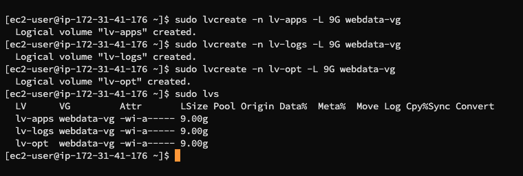
        
    - Formatted the disk as `xfs` instead of `ext4` using 

    >
        sudo mkfs -t xfs /dev/webdata-vg/lv-apps
        sudo mkfs -t xfs /dev/webdata-vg/lv-logs
        sudo mkfs -t xfs /dev/webdata-vg/lv-opt
    
    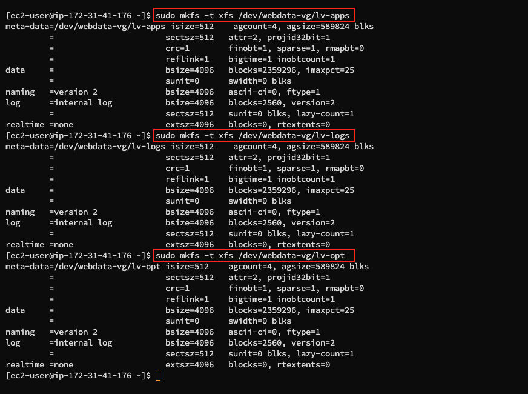

    - Created mount points on `/mnt` directory for the logical volumes using
    >
        cd /mnt
        sudo mkdir -p apps logs opt
    
    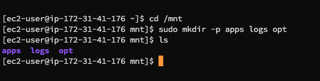

    Mounted:
    1. `lv-apps` on `/mnt/apps` to be used by webservers
    2. `lv-logs` on `/mnt/logs` to be used by webserver logs
    3. `lv-opt` on `/mnt/opt` to be used by Jenkins server in the upcoming Project

    Mounted each lvs as follow using the command:

    >
        sudo mount /dev/webdata-vg/lv-apps /mnt/apps
        sudo mount /dev/webdata-vg/lv-logs /mnt/logs
        sudo mount /dev/webdata-vg/lv-opt /mnt/opt
    
    Used `lsblk` to verify the Mountpoints

    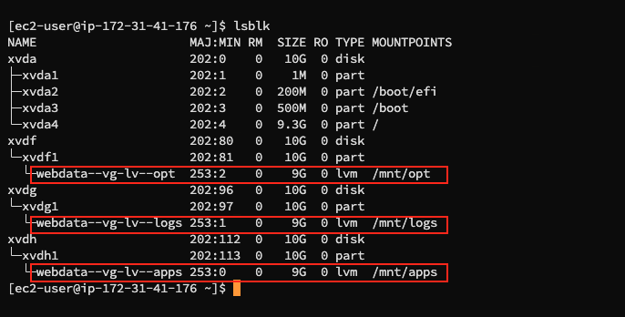

    - Updated `/etc/fstab` file so that the mount configuration will persist after a restart of the server. The UUID of the devices was used to update the `/etc/fstab` file using `sudo blkid` to obtain the UUID.

    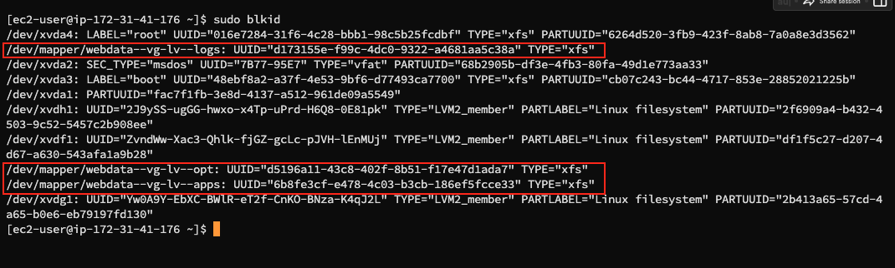

    Used `sudo vim /etc/fstab` to edit the `/etc/fstab` file

   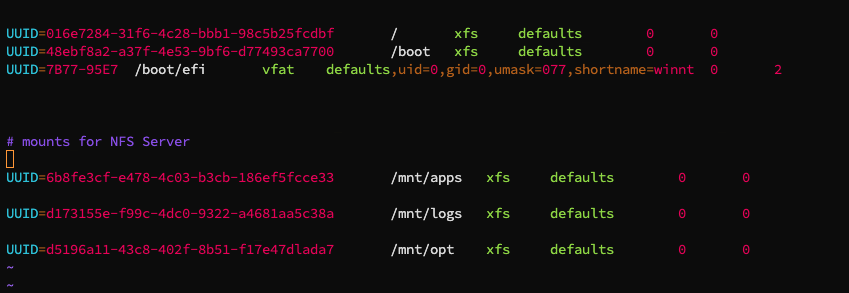

   - Mounted the configuration using `sudo mount -a`
   - Reloaded the daemon using `sudo systemctl daemon-reload`
   - Verified the disk setup using `df -h`

   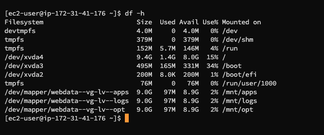

*Note:* Referred to [Implementing Wordpress Website with LVM Storage Management](https://github.com/sukieoduwole/my_darey.io_projects/blob/main/project9_WordPress_with_LVM_storage/readme.md) on details of how to create LVM.

3. Installed NFS Server, configured it to start on reboot and make sure its up and running using the following commands
>
    sudo yum -y update
    sudo yum install nfs-utils -y
    sudo systemctl start nfs-server.service
    sudo systemctl enable nfs-server.service
    sudo systemctl status nfs-server.service

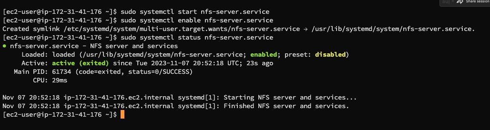

4. Exported the mounts for the webservers' subnet cidr to connect as clients. All the three webservers will be installed in the same subnet. 

    *Note:* For higher level of security in production setup, I would want to seperate each tier inside its own subnet.

    The diagram below explains how to check the subnet for the NFS Server.

    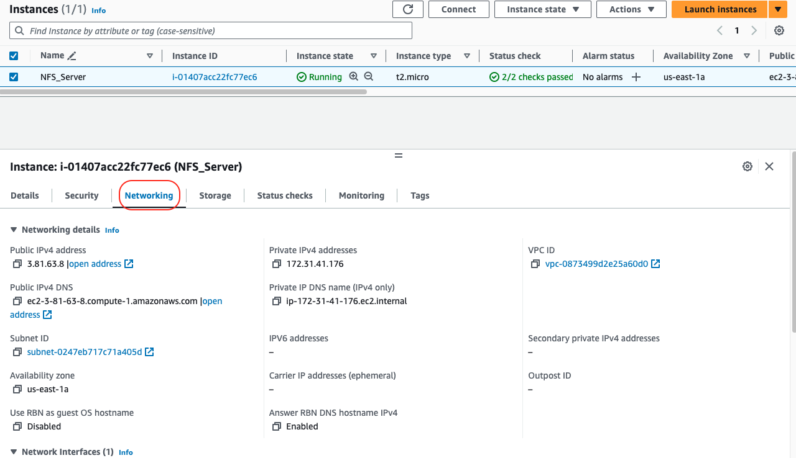
    Clicked the Network tab under the instance details

    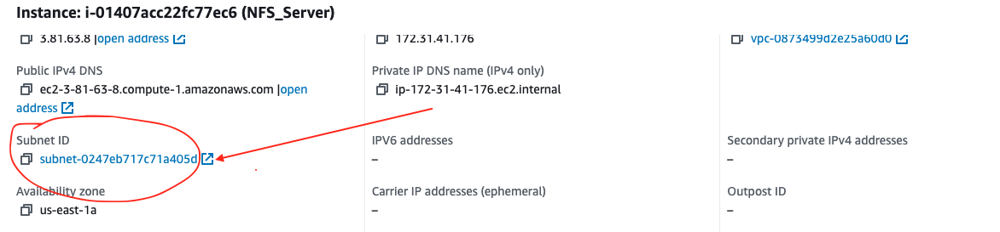
    Scrolled down to Subnet ID and clicked the link on it

    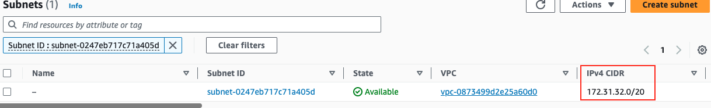
    Here is the Subnet CIDR needed for the next step

    - Set up permission that will allow the webservers to read, write and execute files on NFS using the command below
    >
        sudo chown -R nobody: /mnt/apps
        sudo chown -R nobody: /mnt/logs
        sudo chown -R nobody: /mnt/opt

        sudo chmod -R 777 /mnt/apps
        sudo chmod -R 777 /mnt/logs
        sudo chmod -R 777 /mnt/opt

        sudo systemctl restart nfs-server.service

    - Configured access to NFS for clients within the same subnet by editing the `/etc/exports` file using the subnet CIDR that was located in the above diagram i.e `172.31.32.0/20`. Edited the file using `sudo vi /etc/exports` and pasted and perform the following
    >
        /mnt/apps <Subnet-CIDR>(rw,sync,no_all_squash,no_root_squash)
        /mnt/logs <Subnet-CIDR>(rw,sync,no_all_squash,no_root_squash)
        /mnt/opt <Subnet-CIDR>(rw,sync,no_all_squash,no_root_squash)

        esc + :wq!

        sudo exportfs -arv

    *Note* replaced the < Subnet-CIDR > with my actual Subnet-CIDR

    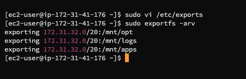

5. Checked which port is used by NFS and opened it by adding new inbound rule on the security group using
>
    rpcinfo -p | grep nfs

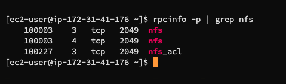

Important note: In order for NFS server to be accessible from the client, the following port must also be opened: TCP 111, UDP 111, UDP 2049

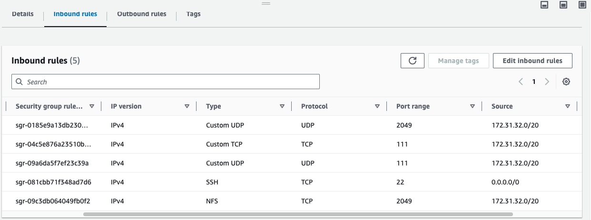

### Step 2 Configuring the database server
- Launched an EC2 instance with Ubuntu 22.04 OS
- Installed MySQL server (details of how to install and configure a database can be revisted [here]((https://github.com/sukieoduwole/my_darey.io_projects/blob/main/project9_WordPress_with_LVM_storage/readme.md)))
- Created a database and named it `tooling` using 
>
    sudo mysql
    CREATE DATABASE tooling;
    CREATE USER `webaccess`@`<NFS-server-subnet-CIDR>` IDENTIFIED BY 'mypass';
    GRANT ALL ON tooling.* TO 'webaccess'@'<NFS-server-subnet-CIDR>';
    FLUSH PRIVILEGES;
    SHOW DATABASES;
    exit

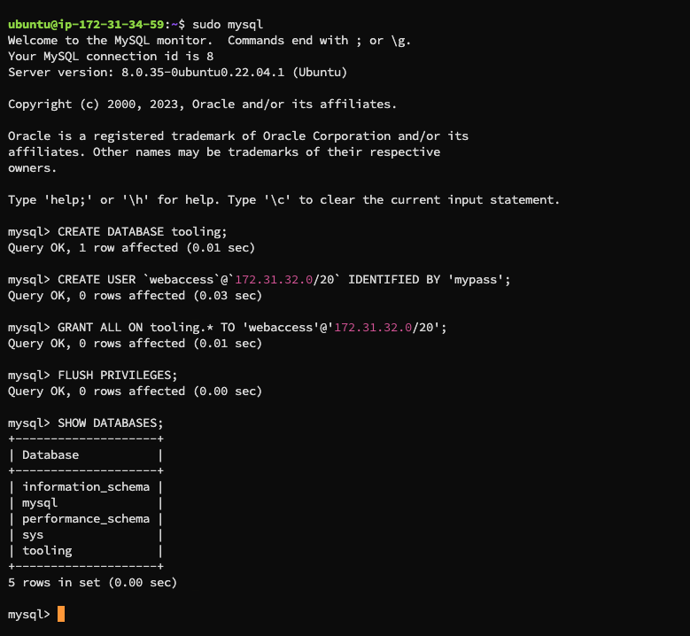

- Opened an inbound rule of the security group to allow connection from the NFS server subnet CIDR

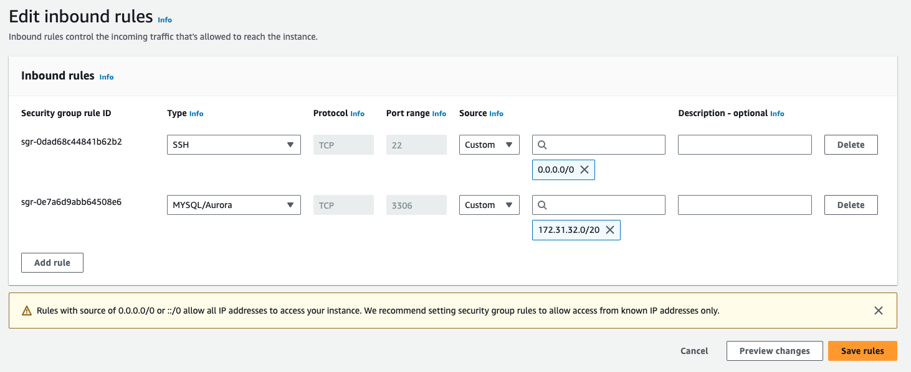

### Step 3 Preparing the Web Servers
I made sure that my Web Servers can serve the same content from a shared storage solutions, in this case the NFS server and the MySQL database. I already know that one DB can be accessed for `reads` and `writes` by multiple clients. For storing shared file that the web servers will use, I will be utilizing the NFS and mounts, previously created Logical Volume `lv-apps` to the folder where Apache stores files to be served to the user (`/var/www`).

This approach will make the web servers stateless, which means I will be able to add new ones or remove them whenever I need, and the integrity of the data will (both database and NFS server) be preserved.

Here is how I implemented that;
- Configured NFS client on all 3 webservers
- Deployed a Tooling application to the webservers into the shared NFS folder
- Configured the web servers to work with a single MySQL database

### Implementation
1. Launched a new EC2 instance with RHEL 9 OS
2. Installed NFS client using `sudo yum install nfs-utils nfs4-acl-tools -y`
3. Mounted `/var/www/` and target the NFS server's export for apps with the following steps 
>
    sudo mkdir /var/www
    sudo mount -t nfs -o rw,nosuid <NFS-Server-Private-IP-Address>:/mnt/apps /var/www

4. Verified that NFS was mounted successfully running `df -h`

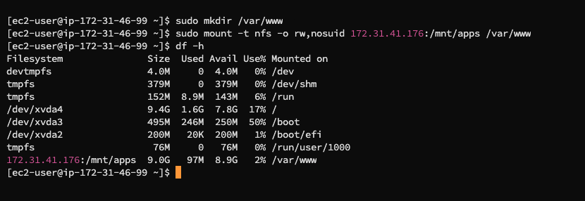

- To ensure changes persist on web server after reboot, I edited the `/etc/fstab` file using `sudo vi /etc/fstab` and adding the following
>
    <NFS-Server-Private-IP-Address>:/mnt/apps /var/www nfs defaults 0 0

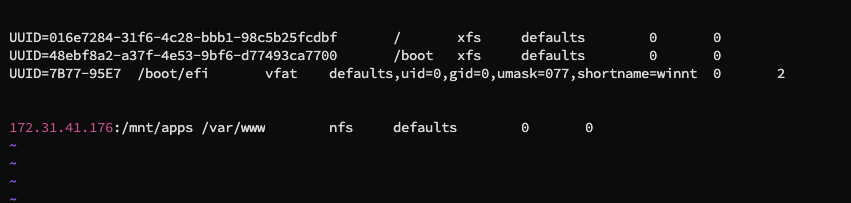

Reloaded the daemon using `sudo systemctl daemon-reload`

5. Installed Remi's repository, Apache and PHP (yet to be implemented)
>
    sudo yum install httpd -y

    sudo dnf install https://dl.fedoraproject.org/pub/epel/epel-release-latest-9.noarch.rpm -y

    sudo dnf install dnf-utils http://rpms.remirepo.net/enterprise/remi-release-9.rpm -y

    sudo dnf module reset php -y

    sudo dnf module enable php:remi-7.4 -y

    sudo dnf install php php-opcache php-gd php-curl php-mysqlnd -y

    sudo systemctl start php-fpm

    sudo systemctl enable php-fpm

    sudo setsebool -P httpd_execmem 1

    sudo systemctl start httpd
    sudo systemctl enable httpd

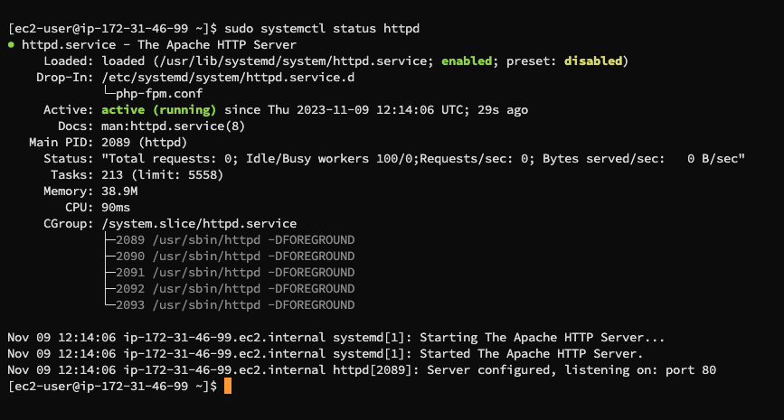
*Note:* Installed remi repo 9 because I used the RHEL 9 OS. If RHEL 8 or any other version is used we simply change the 9 to 8 or any other version number.

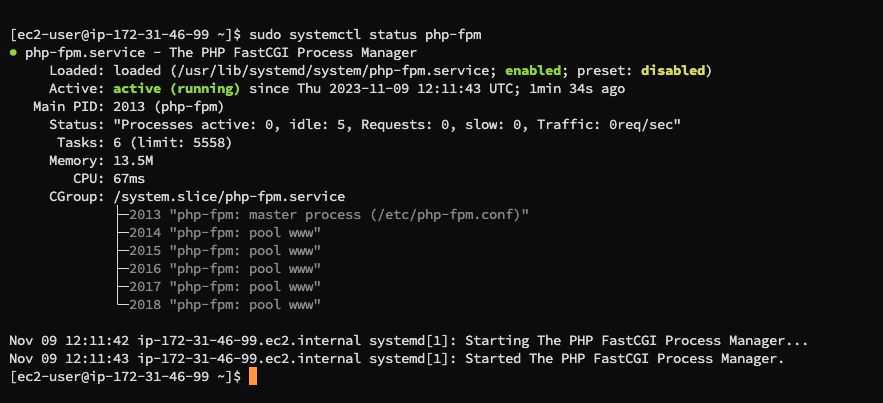

- Launched two other webserver instances with RHEL 9 OS and repeated steps 1 to 5 on them.

6. Verified that Apache files and directories are available on all the webservers in `/var/www` and also on the NFS server in `/mnt/apps`. Seeing the same files on both NFS and webservers confirms NFS is correctly synced with the webservers' `/var/www` directory. Also created a `test.txt` file on one of the webserver's `/var/www` directory and it can seen on all the servers including the NFS server.

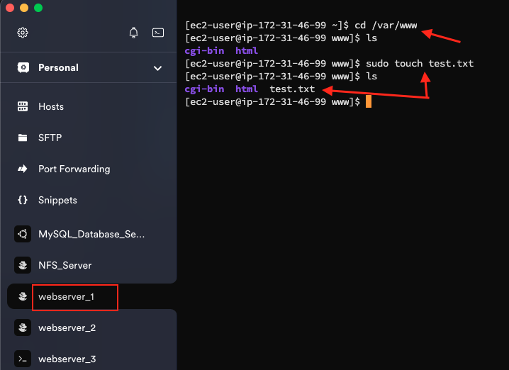

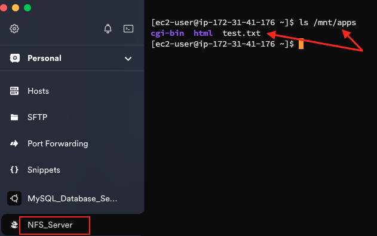

7. Located the log folder for Apache `/var/log/httpd` on the webservers and mounted it to NFS server's export for logs.
>
    sudo mount -t nfs -o rw,nosuid <NFS-Server-Private-IP-Address>:/mnt/logs /var/log/httpd

- To ensure changes persist on web server after reboot, I edited the `/etc/fstab` file using `sudo vi /etc/fstab` and adding the following
>
    <NFS-Server-Private-IP-Address>:/mnt/logs /var/log/httpd nfs defaults 0 0

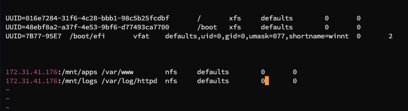

- Reloaded the daemon using `sudo systemctl daemon-reload`

8. Folked the source code from [Darey.io](https://github.com/darey-io/tooling) to my Github account.

9. Deploying the tooling website's code to the webserver: 

- Installed Git using `sudo yum install git -y` on one of the webservers in other to clone the source code for deployment into `/var/www` 
- Used `git clone <repository-url>` to clone the source code into the one of the webservers.

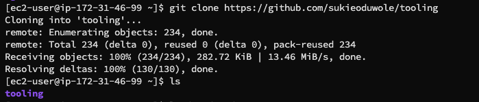

- Changed directory into the cloned directory i.e `cd tooling` to copy the `html` folder into the `/var/www/` directory of the webserver using the command `sudo cp -R html/. /var/www/html`

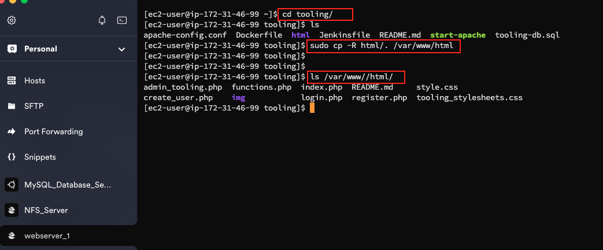
Content of the `/var/www/html` on one webserver is now on all the webservers and the NFS server due to the mount

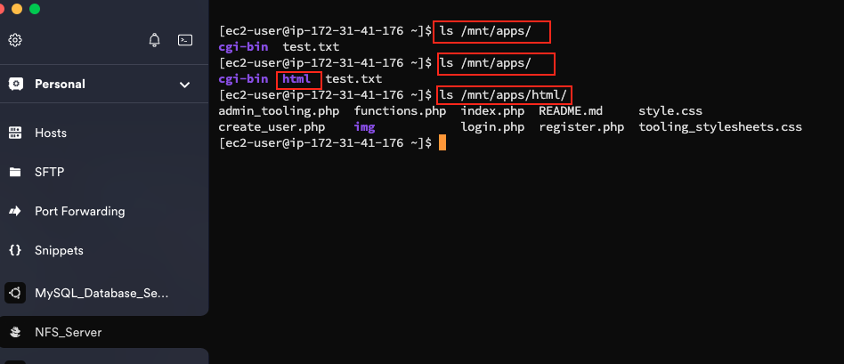

- Opened a TCP port 80 on the webserver security group.

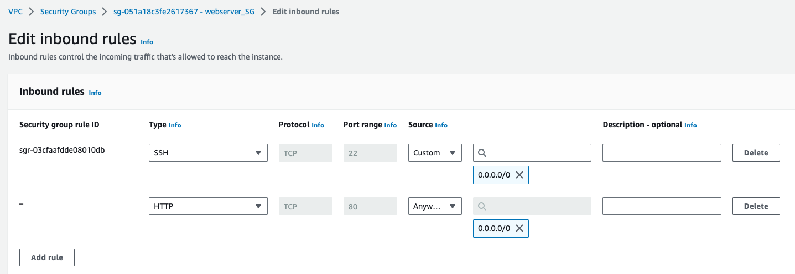

- Configured the SElinux to disable using `sudo setenforce 0`. To make that change permanent edited the `/etc/sysconfig/selinux` using `sudo vi /etc/sysconfig/selinux` and set `SELINUX=disabled`

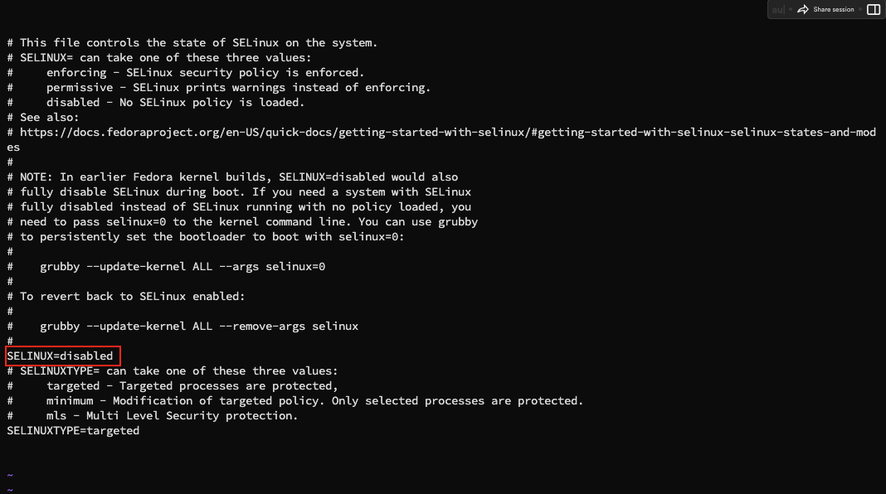

- Restarted httpd using `sudo systemctl restart httpd`
- Repeated this process for all the webservers.

- In the `database server`, I edited the `/etc/mysql/mysql.conf.d/mysqld.cnf` file using `sudo vi /etc/mysql/mysql.conf.d/mysqld.cnf`. Changed the `bind-address` and `mysqlx-bind-address` from `127.0.0.1` to `0.0.0.0` as seen in the screenshoot below

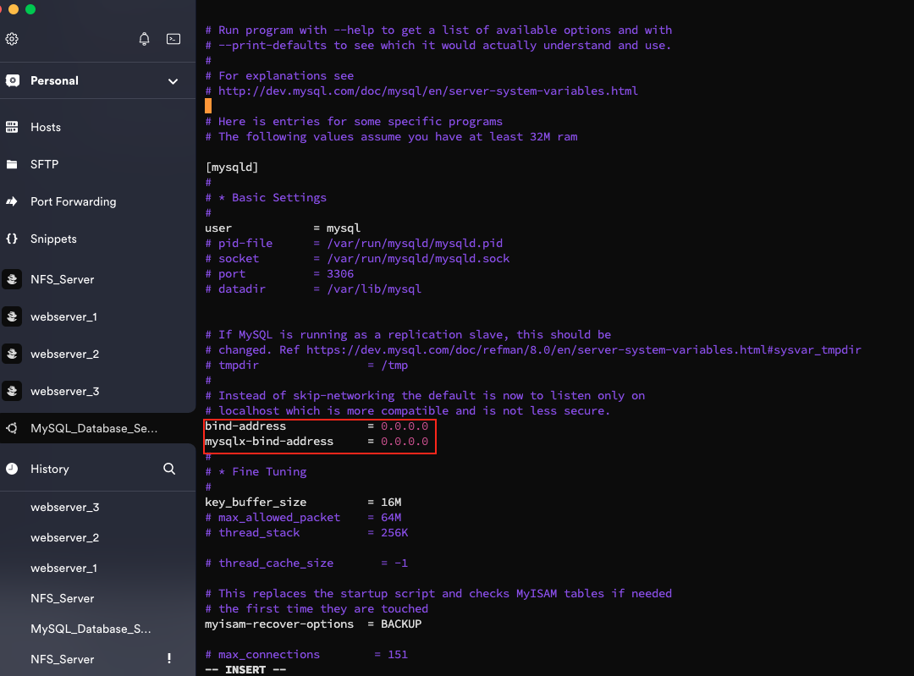

- Restarted the `mysql` service to effect the chnages made using `sudo systemctl restart mysql`

10. I updated the website's configuration from the webserver to connect to the database by editing the `/var/www/html/functions.php` file using `sudo vi /var/www/html/functions.php`

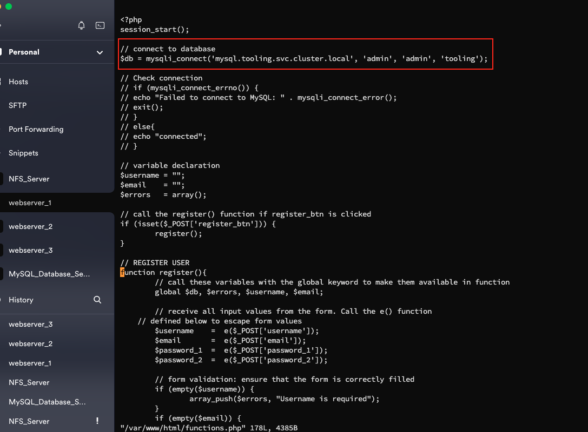

- Changed the `'mysql.tooling.svc.cluster .local'` to the `<database-private-IP>`

- Changed the two `admins` to the `<database-user>` and `<database-password>` respectively.

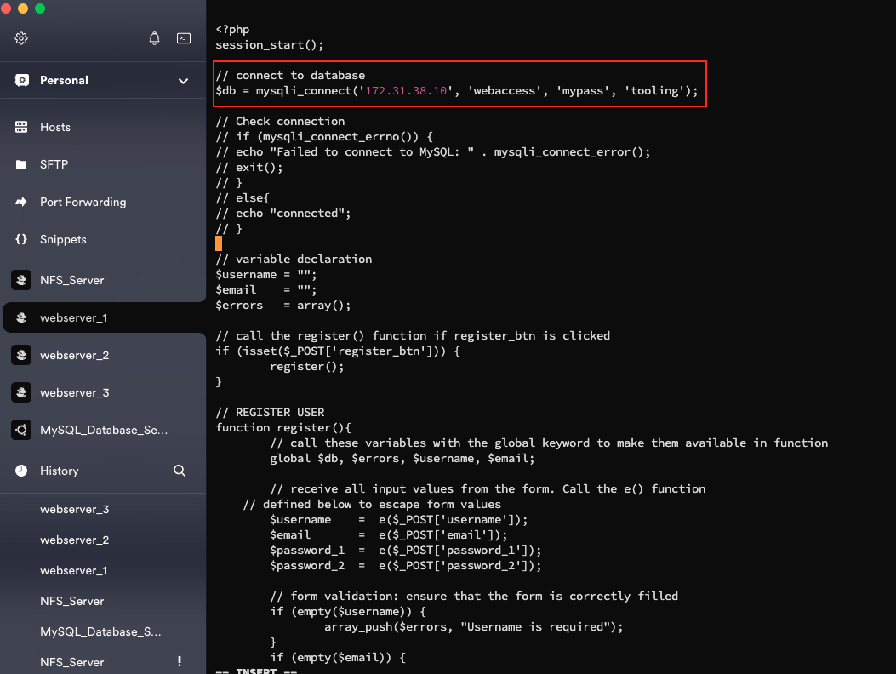

- Saved the file and exited.

11. Injecting the `tooling-db.sql` schema to our database
- Installed `mysql client` on the webservers using `sudo yum install mysql -y` 
- cd into the directory where the schema is i.e `tooling` using `cd tooling`

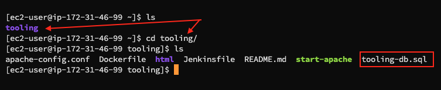

- From the `tooling` directory I ran the command
>
    sudo mysql -h <DB-Server-Private-IP-address> -u <db-username> -p  <database-name> < <schema-name>

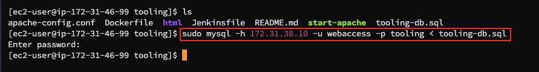

12. Connected to the database from the Database server to be certain the injected schema works by doing the following
>
    sudo mysql
    SHOW DATABASES;
    USE tooling;
    SHOW TABLES;
    SELECT * FROM users;

13. Opened a web browser and pasted the <webserver-Public-IP>/index.php

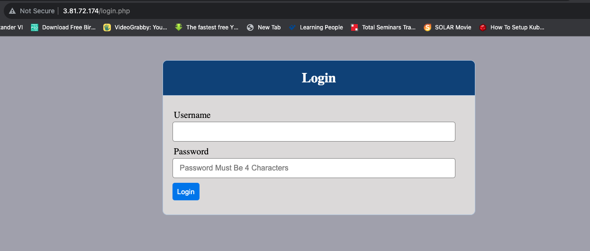

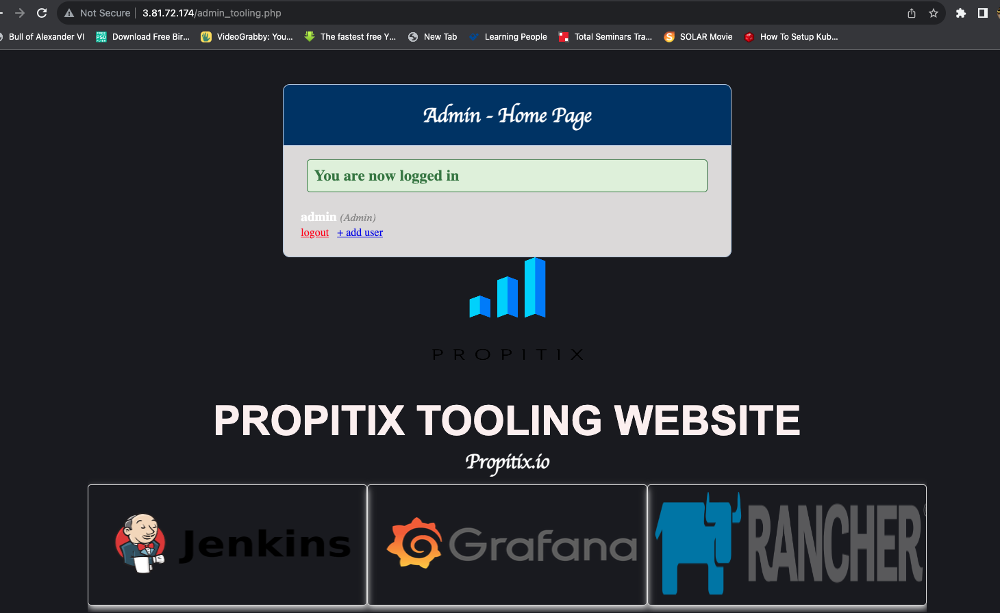

### Project Completed !!