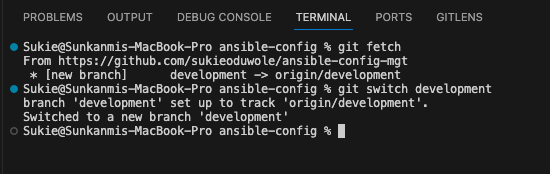
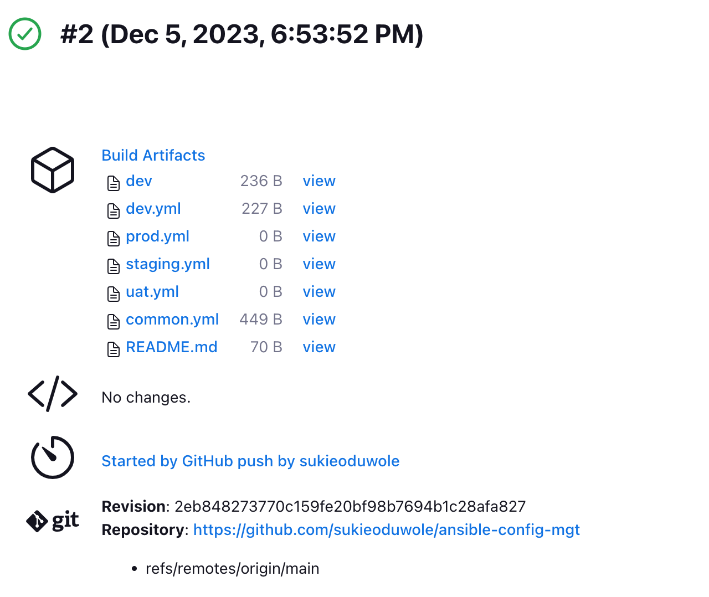

# Ansible-Automate Project
I have implemented some interesting projects up until now and its been awesome. In projects 7 to 10 I performed a lot of manual operations to setup virtual servers, installed and configured required software and deployed web applications.

In this project I will make most of the routine tasks by automating them with [Ansible Configuration Management](https://www.redhat.com/en/topics/automation/what-is-configuration-management#:~:text=Configuration%20management%20is%20a%20process,in%20a%20desired%2C%20consistent%20state.&text=Managing%20IT%20system%20configurations%20involves,building%20and%20maintaining%20those%20systems.). This project will lead to getting confident with writing code using declarative language such as [YAML](https://en.wikipedia.org/wiki/YAML).

### Let's get started!!!

## Ansible Client as a Jump Server (Bastion Host)
A Jump Server (sometimes referred to as Bastion Host) is an intermediary server through which access to intenal network can be provided. The architecture I will be working on (diagram below), ideally, the webservers would be inside a secured network which cannot be reached directly from the Internet. That means, even DevOps engineers cannot SSH into the Web servers directly and can only access it through a Jump Server - it provides better security and reduces attack surface.

On the diagram below the Virtual Private Network (VPC) is divided into two subnets, Public subnet has public IP addresses and Private subnet is only reachable by private IP addresses.

### Tasks
- Install and configure Ansible client to act as a Jump Server/Bastion Host.
- Create a simple Ansible playbook to automate servers configuration.

## Implementation

### Step 1 - Installing and Configuring Ansible on EC2 Instance
1. Launched an EC2 instance with an Ubuntu OS. Tagged it `Jenkins-Ansible`. I will be using this server to run [playbooks](https://docs.ansible.com/ansible/latest/playbook_guide/playbooks_intro.html).

2. Connected to the instance via SSH. Installed Ansible using the shell script below
>
    #!/bin/bash

    # Updating the instance
    sudo apt update -y
    sudo apt upgrade -y

    # nstall software-properties-common package on Ubuntu to enable PPA support
    sudo apt -y install software-properties-common
    sudo add-apt-repository --yes --update ppa:ansible/ansible

    # Installing the latest version of Ansible
    sudo apt install ansible -y

Verify the installation using
>
    ansible --version

3. Installed Jekins on the same instance by running the shell script below
>
    #!/bin/bash

    # jenkins installation

    # updating the instance
    sudo apt update -y

    # This is the Debian package repository of Jenkins to automate installation and upgrade. To use this repository, first add the key to your system:
    sudo wget -O /usr/share/keyrings/jenkins-keyring.asc \
        https://pkg.jenkins.io/debian-stable/jenkins.io-2023.key

    # Then add a Jenkins apt repository entry:
    echo deb [signed-by=/usr/share/keyrings/jenkins-keyring.asc] \
        https://pkg.jenkins.io/debian-stable binary/ | sudo tee \
        /etc/apt/sources.list.d/jenkins.list > /dev/null

    # Update your local package index, then finally install Jenkins:
    sudo apt-get update -y
    sudo apt-get install fontconfig openjdk-11-jre -y
    sudo apt-get install jenkins -y

    sudo systemctl status jenkins

*Note, to run the script: Saved the script with a `.sh` e.g `jenkins-install.sh`. Gave it a permission using `sudo chmod +x jenkins-install.sh`. Ran the script using `./jenkins-install.sh`*

### Configuring Jenkins build job to archive my repository content every time I make changes.

1. Setting up Jenkins server GUI:
- Opened a port `8080` on the security group to allow connection to the jenkins server.
- On the web browser, I pasted `<instance-public-IP>:8080` to start up the Jenkins server setup.

- Located the Jenkins Password using the `cat` command with the path shown above path in the Jenkins server.

- Copy the password above and pasted in the `Administrator password` as shown below, clicked continue button to continue.

- Clicked on the `Install suggested plugins`

- Allowed Jenkins to complete the installation. 

### Back to Github
- Created a new repository and named it `ansible-config-mgt`.

- Created a directory on my local machine using `mkdir ansible-config` using Terminal.

- Opened the directory using `cd Desktop/ansible-config` 
- Copied this from Github and pasted it on my Termial to iniatialise a local repository on my machine.

>
    echo "# ansible-config-mgt" >> README.md
    git init
    git add README.md
    git commit -m "first commit"
    git branch -M main
    git remote add origin https://github.com/sukieoduwole/ansible-config-mgt.git
    git push -u origin main

- The above code from Git created a `Readme.md` file and iniatilise the directory as a local repository. Committed the file and pushed it to the Git repository I created earlier.

### Configuring a webhook in GitHub and setting the webhook to trigger a build.
-  On the `ansible-config-mgt` repository created earlier, I clicked on settings

- Clicked on Webhooks

- Clicked on `Add Webhook` and entered my github account password.
- On the Payload URL, entered the Jenkins URL i.e `http://<jenkins-instance-public_IP>:8080/github-webhook/` and changed the `Content type` to `application/json` and finally clicked `Add webhook` to complete the process.

### Back to Jenkins Server GUI
Created a freestyle project by clicking on the `New Item` on the Dashboard. 

- Named the project `ansible`, selected `Freestyle Project` tab and clicked `OK` to save.

- On the `Configure` page, scrolled to `Source Code Management` clicked Git and in the Repository URL box pasted the Github repository URL.

- Still on the `Configure` page, scrolled to `Build Triggers` and checked the `Github hook trigger for GITScm polling` to allow the webhook I set up earlier work with Jenkins.

### Configuring a Post-build job to save all archived files (**)
- Under the `Post-build Actions` selected the `Archive the artifacts`. In the `Files to archive` box typed in `**`. Clicked Apply and Save. This will allow Jenkins save all the archived file i.e Build artifacts without over riding them.

2. Tested the setup by making some changes to the `README.md` file in the main branch to make sure a build was trigger in Jenkins. Pushed the changes to my Github repository. Using the following Git command

>
    git add .
    git commit -m "commit message"
    git push

- Jenkins saves the files (build artifacts) in following folder
>
    /var/lib/jenkins/jobs/ansible/builds/<build_number>/archive/

- Confirmed that using 
>
  ls  /var/lib/jenkins/jobs/ansible/builds/<build_number>/archive/

This is what my setup looks like now

## Step 2 - Preparing development environment using Visual Studio Code
I opened the local repository `ansible-config` on VsCode (the source code editor) for easy access to writing code and debugging them.

### Step 3 - Ansible Development
1. On Github, I created a new branch "`development`" which will be used for developing new feature in the `ansible-config-mgt`.

- Checkout to the newly created `development` branch on my local machine and start building my code and directory structure.

- While in the newly created branch `development`, created a directory and named it `playbooks` - it will be used to store all my playbook files.

- Also created another directory and named it `inventory` - it will be used to keep my `hosts` organised.

- Within the playbooks folder, created my first playbook, and named it `common.yml`.

- Within the inventory folder, created an inventory file `(.yml)` for each environment *(Development, Staging Testing and Production)* `dev`, `staging`, `uat`, and `prod` respectively. These inventory files uses [.ini](https://en.wikipedia.org/wiki/INI_file) languages style to configure Ansible hosts.

### Step 4 - Setting up an Ansible Inventory

An Ansible inventory file defines the hosts and groups of hosts upon which commands, modules, and tasks in a playbook operate. Since the intention is to execute Linux commands on remote hosts, and ensure that it is the intended configuration on a particular server that occurs. It is important to have a way to organize the hosts in such an Inventory.

Saved the below inventory structure in the `inventory/dev` file to start configuring the development servers. Replaced the private-IP addresses according to my setup.

Updated the `inventory/dev` file with this snippet of code:

>
    [nfs]
    <NFS-Server-Private-IP-Address> ansible_ssh_user=ec2-user

    [webservers]
    <Web-Server1-Private-IP-Address> ansible_ssh_user=ec2-user
    <Web-Server2-Private-IP-Address> ansible_ssh_user=ec2-user

    [db]
    <Database-Private-IP-Address> ansible_ssh_user=ec2-user 

    [lb]
    <Load-Balancer-Private-IP-Address> ansible_ssh_user=ubuntu

*From the inventory code above, there's a need to launch 5 instances, 4 of which are RHEL OS and 1 Ubuntu OS.* 

- Launched 5 instances
    - 1 `NFS server` (RHEL)
    - 2 `Webservers` (RHEL)
    - 1 `Database server` (RHEL) and lastly
    - 1 `load balancer` (Ubuntu) 

**Note:** Ansible uses TCP port 22 by default, which means it needs to ssh into target servers from `Jenkins-Ansible` host (the bastion server) - for this I can implement the concept of ssh-agent. Now I need to import key into ssh-agent:

*To learn how to setup SSH agent please see this video [ssh-agent](https://www.youtube.com/watch?v=OplGrY74qog).*

In order for the bastion server (`Jenkins-Ansible`) to manage and communicate with the host servers, I used the command  below to open the `ssh-agent` and added the key-pair
>
    eval `ssh-agent -s`
    ssh-add <path-to-private-key>

To do this:
- Exited the server from termius 
- On the my local terminal cd into the path where the keypair was saved.
- Pasted the command `eval` above 
- Pasted the `ssh-add <path-to-private-key>` 

Confirmed the key has been added using the command below

>
    ssh-add -l

Now, ssh into your Jenkins-Ansible server using ssh-agent

>
    ssh -A ubuntu@public-ip

Also notice, that your Load Balancer user is `ubuntu` and user for RHEL-based servers is `ec2-user`.

### Step 5 - Creating a Common Playbook
It is time to start giving Ansible the instructions on what is needed to be performed on all servers listed in `inventory/dev`.

In the `common.yml` playbook I wrote configuration for repeatable, re-usable, and multi-machine tasks that is common to systems within the infrastructure.
Updated the `playbooks/common.yml` file with following yaml code:
>
    ---
    -   name: update web, nfs and db servers
        hosts: webservers, nfs, db
        become: yes
        tasks:
            - name: ensure wireshark is at the latest version
            yum:
                name: wireshark
                state: latest
        

    -   name: update LB server
        hosts: lb
        become: yes
        tasks:
            -   name: Update apt repo
                apt: 
                update_cache: yes

            -   name: ensure wireshark is at the latest version
                apt:
                name: wireshark
                state: latest

The playbook above is divided into two parts, each of them is intended to perform the same task: install wireshark utility on the RHEL and Ubuntu servers. It uses root user (hence the `become` part of the code) to perform this task. 

And respective package manager: yum for RHEL and apt for Ubuntu.

*Side Note:* Before I ran the playbook, I setup the anisble configuration file such that ansible disable the host key checking before running the playbook.

The `ansible.cfg` file was placed in the project directory it's therefore project level configuration. It will be a system level configuration if it was configured from the `/etc/ansible/ansible.cfg`

### Step 6 - Updating GIT with the latest code
So far all directories and files live on my local machine and there's a need to push changes made locally to GitHub.

*Note: In the real world, I will be working within a team of other DevOps engineers and developers. It is important to learn how to collaborate with help of GIT. In many organisations there is a development rule that do not allow to deploy any code before it has been reviewed by an extra pair of eyes - it is also called "Four eyes principle".*

Because I am currently working from the `development` branch, I will need to raise a Pull Request (PR), get your branch peer reviewed and merged to the main branch.

### Committing code into GitHub:

1. Used git commands to add, commit and push branch to GitHub.
>
    git status

    git add <selected files>

    git commit -m "commit message"

    git push

2. Created a Pull request (PR) from GitHub

3. I assumed the role of another developer and acted as a reviewer.

4. If the reviewer is happy with the new feature development, merge the code to the master branch.

5. Head back to terminal, checkout from the `development` branch into the `main`, and pull down the latest changes.

Once the code changes appear in main branch - Jenkins will do its job and save all the files (build artifacts) to /var/lib/jenkins/jobs/ansible/builds/<build_number>/archive/ directory on Jenkins-Ansible server.

### Step 7 - Running first Ansible test
Now, it is time to execute ansible-playbook command and verify if the playbook actually works:

- Cloned the remote repo on the bastion server so I can run the playbook.

- Changed directory into the downloaded repo using the command:
>
    cd ansible-config-mgt/

- To run the playbook, used the command
>
    ansible-playbook -i inventory/dev playbooks/common.yml

This is what the architecture now look like

### Step 8 - Updated the Playbook
Updated the playbook to run some tasks such as:
- Creating a directory and a file inside it.
- Changing timezone on all servers to `UTC`
- Ran a shell script to install Nginx on the `lb server` using the updated Yaml code below
>
    ---
    - name: update web, nfs and db servers
    hosts: webservers, nfs, db
    become: yes
    tasks:
        - name: ensure wireshark is at the latest version
          yum:
            name: wireshark
            state: latest
    

    - name: update LB server
      hosts: lb
      become: yes
      tasks:
        - name: Update apt repo
          apt: 
            update_cache: yes

        - name: ensure wireshark is at the latest version
          apt:
            name: wireshark
            state: latest

        - name: Create directory
          file:
            path: home/ubuntu/test-dir/
            state: directory
            mode: '0755'

        - name: Create file inside the directory
          file:
            path: home/ubuntu/test-dir/file.txt
            state: touch
            mode: '0644'

        - name: Set timezone to UTC
          timezone:
            name: Etc/UTC
        
        - name: Copy Nginx installation script to lb server
          copy:
            src:  /home/ubuntu/ansible-config-mgt/playbooks/nginx-install.sh
            dest: home/ubuntu/test-dir/nginx-install.sh
            mode: '0755'

        - name: Execute Nginx installation script on lb server
          shell: home/ubuntu/test-dir/nginx-install.sh
          ignore_errors: true

*Note* I made the `common.yml` script install nginx using a script. For the script to work I had to place it in the playbook directory. And in the playbook I included the line 

>
    - name: Copy Nginx installation script to lb server
          copy:
            src:  /home/ubuntu/ansible-config-mgt/playbooks/nginx-install.sh
            dest: home/ubuntu/test-dir/nginx-install.sh
            mode: '0755'

        - name: Execute Nginx installation script on lb server
          shell: home/ubuntu/test-dir/nginx-install.sh
          ignore_errors: true

Note the `scr`; the source will be gotten from the `jenkins-ansible`server after its been pulled from the remote repository.

## Project Completed

