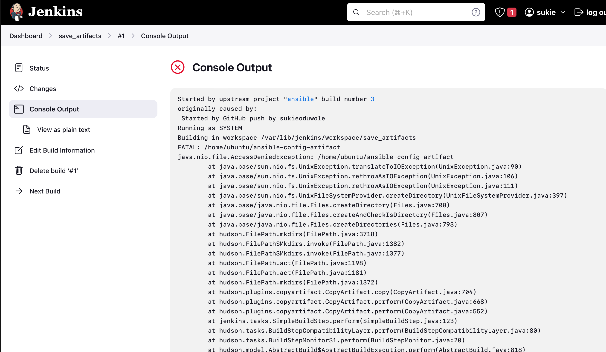

# Ansible Refactoring & Static Assignments (Imports and Roles)

In this project I will continue working with [ansible-config-mgt](https://github.com/sukieoduwole/ansible-config-mgt) repository and make some improvements to my code. Now I need to refactor my Ansible code, create assignments, and learn how to use the imports functionality. Imports allow to effectively re-use previously created playbooks in a new playbook - it allows to organize tasks and reuse them when needed.

**Side Self Study:** For better understanding on Ansible artifacts re-use - [read this article](https://docs.ansible.com/ansible/latest/playbook_guide/playbooks_reuse.html).

## Code Refactoring
[Refactoring](https://en.wikipedia.org/wiki/Code_refactoring) is a general term in computer programming. It means making changes to the source code without changing expected behaviour of the software. The main idea of refactoring is to enhance code readability, increase maintainability and extensibility, reduce complexity, add proper comments without affecting the logic.
In my case, I will move things around a little bit in the code, but the overal state of the infrastructure remains the same.

### Step 1 - Jenkins job enhancement
Before I begin, some changes will be made to the Jenkins job - as it is now, every new change in the code create a separate directory which is not very convenient when I want to run some commands from one place. Besides, it consumes space on Jenkins serves with each subsequent change. I will enhance it by introducing a new Jenkins project/job - will require `Copy Artifact` plugin.

1. From the `Jenkins-Ansible` server, created a new directory called `ansible-config-artifact` - here I will store all artifacts after each build. 
>
    sudo mkdir /home/ubuntu/ansible-config-artifact 
    

2. Changed permissions to this directory, so Jenkins could save files there - `sudo chmod -R 0777 /home/ubuntu/ansible-config-artifact`

*Using 0777 gives full read, write, and execute permissions to everyone. While this command ensures that Jenkins (or any other user) can access and modify files within /home/ubuntu/ansible-config-artifact, it's important to consider the security implications of such open permissions, especially on sensitive directories.*

3. Go to Jenkins web console -> Manage Jenkins ->  Plugins -> on Available plugins tab searched for `Copy Artifact` and installed this plugin without restarting Jenkins.

4. Created a new Freestyle project and named it `save_artifacts`.

5. This project will be triggered by completion of the existing `ansible` project. Configured it accordingly:

**Note:** You can configure number of builds to keep in order to save space on the server, for example, you might want to keep only last 2 or 5 build results. You can also make this change to your ansible job.

6. The main idea of `save_artifacts` project is to save artifacts into `/home/ubuntu/ansible-config-artifact` directory. To achieve this, created a `Build step` and choose `Copy artifacts from other project`, specify `ansible` as a source project and `/home/ubuntu/ansible-config-artifact` as a target directory.

7. Tested the set up by making some change in `README.MD` file main branch of the `ansible-config-mgt` repository.

If both Jenkins jobs have completed one after another - you shall see your files inside /home/ubuntu/ansible-config-artifact directory and it will be updated with every commit to your main branch.

Now your Jenkins pipeline is more neat and clean.

*Note: I encounter an error while the `save_artifacts` job was building.*

Jenkins could not access `/home/ubuntu/ansible-config-artifact`, despite given full permission to all user above using `sudo chmod -R 0777 /home/ubuntu/ansible-config-artifact`.

**How I corrected it**

1. Gave ownership of `/home/ubuntu/` directory to `jenkins` as a user using `sudo chown -R jenkins:jenkins /home/ubuntu/`

3. Adjusted the permissions on the `/home/ubuntu/ansible-config-artifact` directory using `sudo chmod -R 755 /home/ubuntu/ansible-config-artifact`

4. Restarted Jenkins using `sudo service jenkins restart`

5. Returned the ownership of `/home/ubuntu` using `sudo chown -R ubuntu:ubuntu /home/ubuntu`

6. Adjusted the ownership of `/home/ubuntu/ansible-config-artifact` using `sudo chown -R jenkins:jenkins /home/ubuntu/ansible-config-artifact`

This is what the `/home/ubuntu` ownership looks like after the correction

### Step 2 - Refactor Ansible code by importing other playbooks into site.yml

Before starting to refactor the codes, I created a new branch, name it refactor.

DevOps philosophy implies constant iterative improvement for better efficiency - refactoring is one of the techniques that can be used, but you always have an answer to question "why?". Why do we need to change something if it works well?

In [Project 11](https://github.com/sukieoduwole/my_darey.io_projects/blob/main/project11_Ansible_Automate_Project/README.md) I wrote all tasks in a single playbook `common.yml`, now it is pretty simple set of instructions for only 2 types of OS, but imagine having many more tasks and need to apply this playbook to other servers with different requirements. In this case, I will have to read through the whole playbook to check if all tasks written there are applicable and if there's anything that needed to add for certain server/OS families. Very fast it will become a tedious exercise and the playbook will become messy with many commented parts. My DevOps colleagues will not appreciate such organization of codes and it will be difficult for them to use the playbook.

*Note:* Breaking tasks up into different files is an excellent way to organize complex sets of tasks and reuse them.

Let see code re-use in action by importing other playbooks.

1. Within playbooks folder, created a new file and name it `site.yml` - This file will now be considered as an entry point into the entire infrastructure configuration. Other playbooks will be included here as a reference. In other words, `site.yml` will become a parent to all other playbooks that will be developed. Including `common.yml` that was created previously.

2. Created a new folder in root of the repository and name it `static-assignments`. The `static-assignments` folder is where all other children playbooks will be stored. This is merely for easy organization of my work.

3. Moved `common.yml` file into the newly created `static-assignments` folder.

4. Inside `site.yml` file, imported `common.yml` playbook.

>
    ---
    - hosts: all
    - import_playbook: ../static-assignments/common.yml

The code above uses built in [import_playbook](https://docs.ansible.com/ansible/latest/collections/ansible/builtin/import_playbook_module.html) Ansible module.

Your folder structure should look like this;

>
    ├── static-assignments
    │   └── common.yml
    ├── inventory
        └── dev
        └── stage
        └── uat
        └── prod
    └── playbooks
        └── site.yml

5. Ran `ansible-playbook` command against the `dev.yml` environment, using 
>
    ansible-playbook -i inventory/dev.yml playbooks/site.yml  

Before then, I pushed all the changes made on my local machine to my remote repository.

Since there's need to apply some tasks to the `dev` servers and wireshark is already installed - I created another playbook under `static-assignments` and named it `common-del.yml`. In this playbook, configured deletion of wireshark utility.

>
    ---
    - name: update web, nfs and db servers
    hosts: webservers, nfs, db
    remote_user: ec2-user
    become: yes
    become_user: root
    tasks:
    - name: delete wireshark
        yum:
        name: wireshark
        state: removed

    - name: update LB server
    hosts: lb
    remote_user: ubuntu
    become: yes
    become_user: root
    tasks:
    - name: delete wireshark
        apt:
        name: wireshark-qt
        state: absent
        autoremove: yes
        purge: yes
        autoclean: yes

Updated `site.yml` with - `import_playbook: ../static-assignments/common-del.yml` instead of `common.yml` 

>
    ---
    - hosts: all
    - import_playbook: ../static-assignments/common-del.yml

and run it from the `jenkins-ansible` server against `dev` servers, using:

>
    cd /home/ubuntu/ansible-config-mgt/

    ansible-playbook -i inventory/dev.yml playbooks/site.yml

Logged into one of the servers using `ssh <user>@<private-ip>` to ensure wireshark is deleted on all the servers by running `wireshark --version`.

*Note:* Before running the command, I pushed the changes to the `refactor` branch and did a pull request to the main branch. On the `ansible-config-mgt` directory of the `jenkins-ansible` server, I pulled the up to date change of the code to the directory in order to run the command to delete the wireshark.

Now I have been able to use `import_playbooks` module and I have a ready solution to install/delete packages on multiple servers with just one command.

### Step 3 - Configuring UAT Webservers with a role 'Webserver'

Now I have a nice and clean `dev` environment, so I will be configuring 2 new Web Servers as `uat`. I could write tasks to configure Web Servers in the same playbook, but it would be too messy, instead, I will use a dedicated role to make the configuration reusable.

1. Launched 2 fresh EC2 instances using RHEL OS, used them as my `uat servers`, so named accordingly - `Web1-UAT` and `Web2-UAT`.

*Note: I stopped all EC2 instances expect the 2 new RHEL instances and the existing `Jenkins-Ansible` server to avoid running cost.* 

2. To create a role, I created a directory called `roles/`, relative to the playbook file or in `/etc/ansible/` directory.

There are two ways to create this folder structure:

- Use an Ansible utility called `ansible-galaxy` inside `ansible-config-mgt/roles` directory (you need to create roles directory upfront)

*Note: Ensure Ansible is installed on the system i.e local system, before using the ansible utilitiy*

>
    mkdir roles
    cd roles
    ansible-galaxy init webserver

- Create the directory/files structure manually i.e as seen in the diagram above.

**Note:** You can choose either way, but since you store all your codes in GitHub, it is recommended to create folders and files there rather than locally on Jenkins-Ansible server.

The entire folder structure above looks like below. If created manually - you can skip creating tests, files, and vars or remove them if you used ansible-galaxy.

>
    └── webserver
    ├── README.md
    ├── defaults
    │   └── main.yml
    ├── files
    ├── handlers
    │   └── main.yml
    ├── meta
    │   └── main.yml
    ├── tasks
    │   └── main.yml
    ├── templates
    ├── tests
    │   ├── inventory
    │   └── test.yml
    └── vars
        └── main.yml

After removing unnecessary directories and files, the roles structure should look like this:

>
    └── webserver
    ├── README.md
    ├── defaults
    │   └── main.yml
    ├── handlers
    │   └── main.yml
    ├── meta
    │   └── main.yml
    ├── tasks
    │   └── main.yml
    └── templates

3. Updated the inventory `ansible-config-mgt/inventory/uat.yml` file with IP addresses of the 2 UAT Web servers.

>
    [uat-webservers]
    <Web1-UAT-Server-Private-IP-Address> ansible_ssh_user='ec2-user'
    <Web2-UAT-Server-Private-IP-Address> ansible_ssh_user='ec2-user'

**NOTE:** Ensured using ssh-agent to ssh into the Jenkins-Ansible instance just as I did in [project 11](https://github.com/sukieoduwole/my_darey.io_projects/blob/main/project11_Ansible_Automate_Project/README.md)

4. In `/etc/ansible/ansible.cfg` file uncomment `roles_path` string and provide a full path to your roles directory `roles_path = /home/ubuntu/ansible-config-mgt/roles`, so Ansible could know where to find configured roles.

5. Added some logic to the `webserver role`. From the `tasks` directory within the `main.yml` file, wrote configuration tasks to do the following:

- Install and configure Apache (httpd service)

- Clone Tooling website from GitHub https://github.com/sukieoduwole/tooling.git

- Ensure the tooling website code is deployed to /var/www/html on each of 2 UAT Web servers.

- Make sure httpd service is started

The `main.yml` may consist of following tasks:

>
    ---
    - name: install apache
    become: true
    ansible.builtin.yum:
        name: "httpd"
        state: present

    - name: install git
    become: true
    ansible.builtin.yum:
        name: "git"
        state: present

    - name: clone a repo
    become: true
    ansible.builtin.git:
        repo: https://github.com/sukieoduwole/tooling.git
        dest: /var/www/html
        force: yes

    - name: copy html content to one level up
    become: true
    command: cp -r /var/www/html/html/ /var/www/

    - name: Start service httpd, if not started
    become: true
    ansible.builtin.service:
        name: httpd
        state: started

    - name: recursively remove /var/www/html/html/ directory
    become: true
    ansible.builtin.file:
        path: /var/www/html/html
        state: absent

### Step 4 - Reference 'Webserver' role
Within the `static-assignments` folder, created a new assignment for `uat-webservers` `uat-webservers.yml`. This is where you I referenced the role.

>
    ---
    - hosts: uat-webservers
    roles:
        - webserver

My entry point to the ansible configuration is the `site.yml` file. Therefore, refered the `uat-webservers.yml` role inside `site.yml`.

This is what I now have in `site.yml`

>
    ---
    - hosts: all
    - import_playbook: ../static-assignments/common.yml

    - hosts: uat-webservers
    - import_playbook: ../static-assignments/uat-webservers.yml

### Step 5 - Commit & Test
Committed the changes, created a Pull Request and merge them to `main` branch.

Ran the playbook against the `uat` inventory using

>
    cd /home/ubuntu/ansible-config-mgt

    ansible-playbook -i /inventory/uat.yml playbooks/site.yml

Both UAT Web servers are configured and you can be reached from a browser usiing:

>
    http://<Web1-UAT-Server-Public-IP-or-Public-DNS-Name>/index.php

The Ansible architecture now looks like this:

