# Ansible Dynamic Assignments (Include) and Community Roles

In the last 2 projects I have been equipped with knowledge and skills on implementing Ansible projects. I can now perform configurations using `playbooks`, `roles` and `imports`. 

In this project I will continue configuring the `UAT servers` learning and practicing new Ansible concepts and modules.
I will be looking at [dynamic assignments](https://docs.ansible.com/ansible/latest/playbook_guide/playbooks_reuse.html#includes-dynamic-re-use) by using `include` module.

What is the difference between **static** and **dynamic** assignments?

In [Project 12](https://github.com/sukieoduwole/my_darey.io_projects/blob/main/project12_Ansible_Refactoring/Readme.md), I learnt that **static assignments** uses `import` Ansible module. However, in the current project, I will explore how the module that enables **dynamic assignments** is `include`.

>
    import = Static
    include = Dynamic

When the **import** module is used, all statements are pre-processed at the time playbooks are [parsed](https://en.wikipedia.org/wiki/Parsing). Meaning, when you execute `site.yml` playbook, Ansible will process all the playbooks referenced during the time it is parsing the statements. This also means that, during actual execution, if any statement changes, such statements will not be considered. Hence, it is static.

On the other hand, when **include** module is used, all statements are processed only during execution of the playbook. Meaning, after the statements are **parsed**, any changes to the statements encountered during execution will be used.

Note that in most cases it is recommended to use static assignments for playbooks, because it is more reliable. With dynamic ones, it is hard to debug playbook problems due to its dynamic nature. However, dynamic assignments can be used for environment specific variables as I will be demostrating in this project.

### Introducing Dynamic Assignment Into the structure
In the https://github.com/sukieoduwole/ansible-config-mgt GitHub repository, started a new branch and called it `dynamic-assignments`.

Created a new folder, named it `dynamic-assignments`. Then inside this folder, created a new file and named it `env-vars.yml`. I will instruct `site.yml` to include this playbook later. For now, let us keep building up the structure.

My GitHub have following structure by now.
>
    ├── dynamic-assignments
    │   └── env-vars.yml
    ├── inventory
    │   └── dev
        └── stage
        └── uat
        └── prod
    └── playbooks
        └── site.yml
    └── roles (optional folder)
        └──...(optional subfolders & files)
    └── static-assignments
        └── common.yml
        └── common-del.yml
        └── uat-webservers.yml

Since I will be using the same Ansible to configure multiple environments, and each of these environments will have certain unique attributes, such as **servername**, **ip-address** etc., I will need a way to set values to variables per specific environment.

For this reason, I created a folder to keep each environment's variables file. Named the newly created folder `env-vars`, then for each environment, create new `YAML` files which we will use to set variables.

Here's what my layout now look like.

>
    ├── dynamic-assignments
    │   └── env-vars.yml
    ├── env-vars
        └── dev.yml
        └── stage.yml
        └── uat.yml
        └── prod.yml
    ├── inventory
        └── dev
        └── stage
        └── uat
        └── prod
    ├── playbooks
        └── site.yml
    └── static-assignments
        └── common.yml
        └── webservers.yml

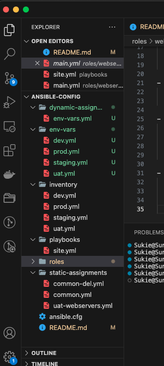

In the `dynamic assignment` folder, pasted the instruction below into the `env-vars.yml` file.

>
    ---
    - name: collate variables from env specific file, if it exists
    hosts: all
    tasks:
        - name: looping through list of available files
        include_vars: "{{ item }}"
        with_first_found:
            - files:
                - dev.yml
                - stage.yml
                - prod.yml
                - uat.yml
            paths:
                - "{{ playbook_dir }}/../env-vars"
        tags:
            - always

3 things to notice here:

1. Used `include_vars` syntax instead of `include`, this is because Ansible developers decided to separate different features of the module. From Ansible version 2.8, the `include` module is deprecated and variants of `include_*` must be used. These are:

- [include_role](https://docs.ansible.com/ansible/latest/collections/ansible/builtin/include_role_module.html#include-role-module)
- [include_tasks](https://docs.ansible.com/ansible/latest/collections/ansible/builtin/include_tasks_module.html#include-tasks-module)
- [include_vars](https://docs.ansible.com/ansible/latest/collections/ansible/builtin/include_vars_module.html#include-vars-module)

In the same version, variants of **import** were also introduces, such as:

- [import_role](https://docs.ansible.com/ansible/latest/collections/ansible/builtin/import_role_module.html#import-role-module)
- [import_tasks](https://docs.ansible.com/ansible/latest/collections/ansible/builtin/import_tasks_module.html#import-tasks-module)

2. Made use of a [special variables](https://docs.ansible.com/ansible/latest/reference_appendices/special_variables.html) `{{ playbook_dir }}` and `{{ inventory_file }}`. 

- `{{ playbook_dir }}` will help Ansible to determine the location of the running playbook, and from there navigate to other path on the filesystem. 

- `{{ inventory_file }}` on the other hand will dynamically resolve to the name of the inventory file being used, then append `.yml` so that it picks up the required file within the `env-vars` folder.

3. Included the variables using a loop. `with_first_found` implies that, looping through the list of files, the first one found is used. This is good so that we can always set default values in case an environment specific env file does not exist.

### Update site.yml with dynamic assignments
Updated the `site.yml` file to make use of the dynamic assignment. *(At this point, it cannot be tested yet. Just setting the stage for what is yet to come).*

`site.yml` should now look like this.
>
    ---
    - hosts: all
    - name: Include dynamic variables 
    tasks:
    import_playbook: ../static-assignments/common.yml 
    include: ../dynamic-assignments/env-vars.yml
    tags:
        - always

    - hosts: webservers
    - name: Webserver assignment
    import_playbook: ../static-assignments/webservers.yml

### Community Roles
Now it is time to create a role for MySQL database - it should install the MySQL package, create a database and configure users. But why re-invent the wheel? There are tons of roles that have already been developed by other open source engineers out there. These roles are actually production ready, and dynamic to accomodate most of Linux flavours. With Ansible Galaxy again, I simply downloaded a ready to use ansible role.

### Downloading Mysql Ansible Role
Community roles are available [here](https://galaxy.ansible.com/ui/). I used a [MySQL role developed by geerlingguy](https://galaxy.ansible.com/ui/standalone/roles/geerlingguy/mysql/).

**Hint:** To preserve the GitHub repo in actual state after installing a new role - I made a commit and pushed to the main branch of the `ansible-config-mgt` directory. For more convenient work with codes, I configured Visual Studio Code to connect through SSH with the server. In this case, I will no longer need webhook and Jenkins jobs to update codes on `Jenkins-Ansible` server. I will be using Jenkins later for a better purpose.

[How to Connect EC2 Instance from Visual Studio Code](https://www.youtube.com/watch?v=8rNCUaSIjLA)

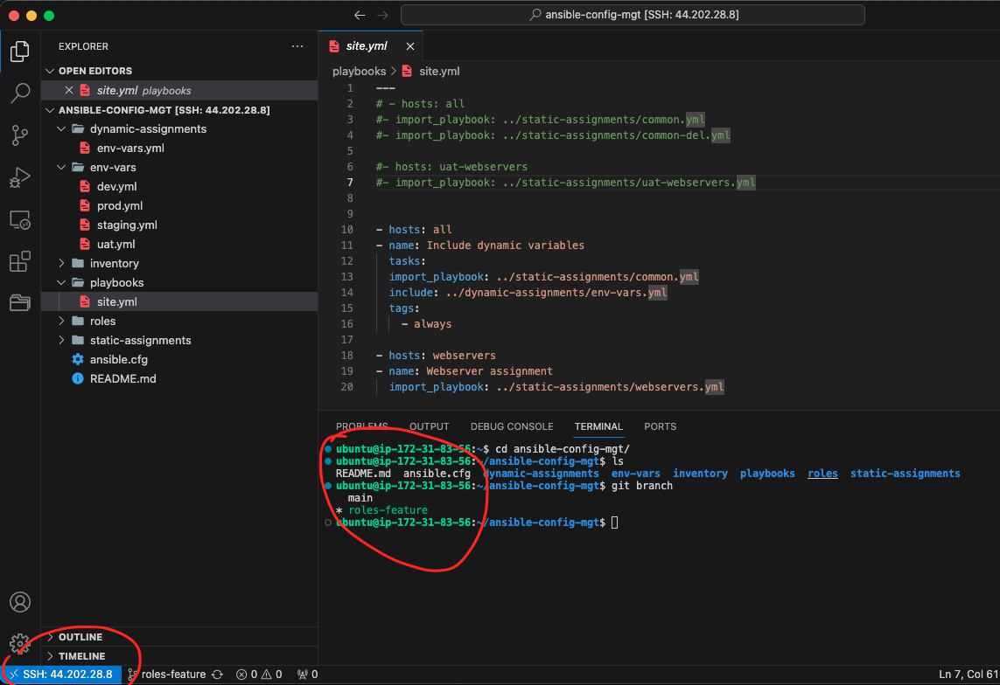

On `Jenkins-Ansible` server I ensured `git` is installed by checking with `git --version`. While in the `ansible-config-mgt` directory ran the command

>
    git branch roles-feature
    git switch roles-feature

If this was a fresh project, at this point I was suppose to run the following command
>
    git init
    git pull https://github.com/<your-name>/ansible-config-mgt.git
    git remote add origin https://github.com/<your-name>/ansible-config-mgt.git
    git branch roles-feature
    git switch roles-feature

But because this project was a continuation from two previous ones, I do not have to run the first three lines of the commands above because it is previously connect to Github.

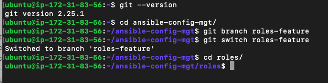

Inside `roles` directory, created a new MySQL role with `ansible-galaxy install geerlingguy.mysql` and renamed the folder to `mysql`

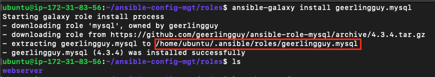

From the above image we can see that the role was created in the `/home/ubuntu/.ansible/roles/` directory. Therefore I moved it into `/home/ubuntu/ansible-config-mgt/roles` and renamed it `mysql`

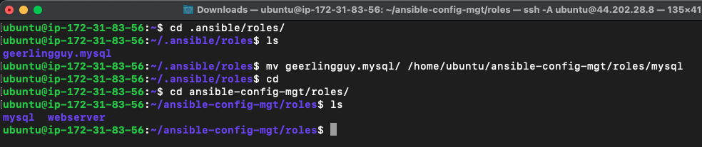

Read the `README.md` file from the newly created `MySQL` directory , and edit roles configuration to use correct credentials for `MySQL` required for the tooling website.

### Creating a User & Database by editing MySQL Credentials

From the `default` directory of `MySQL` directory, editied the `main.yml` file by uncommenting the credentials of the Database and User. Filled the values which needed to be filled

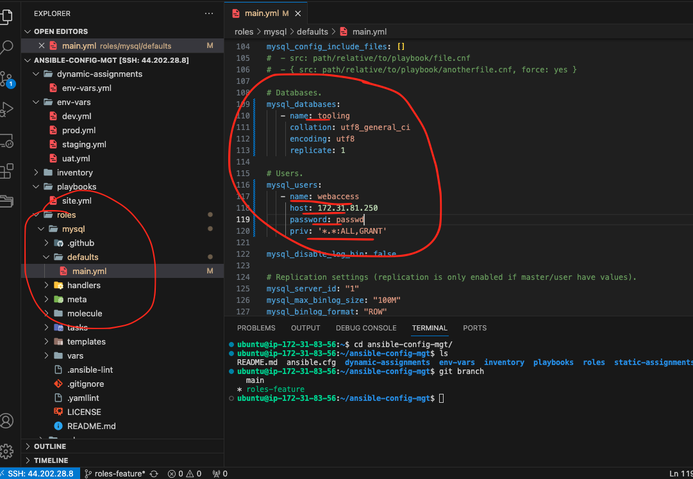

Next created a `db.yml` in the `static-assignments` folder to be used as a role in the playbook.

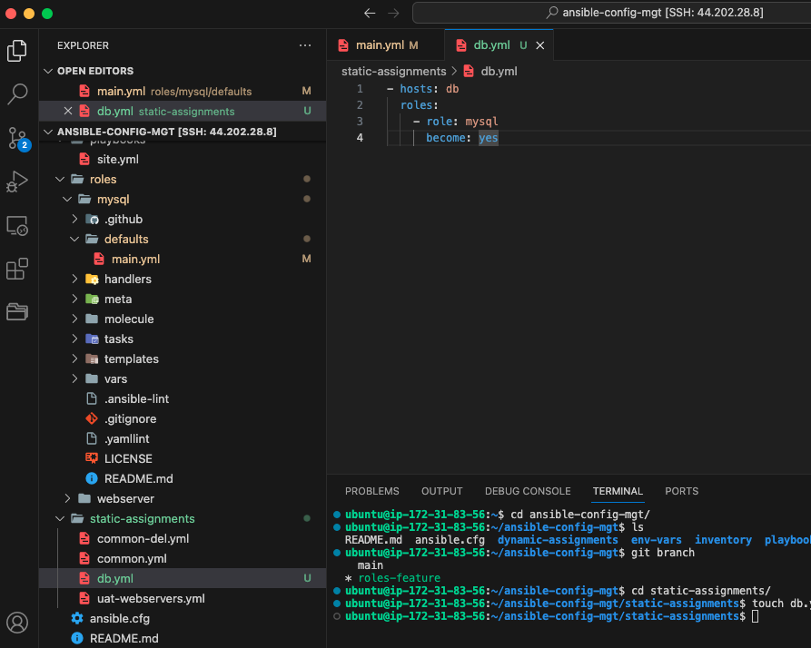

### Load Balancer roles
In order to have a load balancer choice, I decided to use, `Nginx` or `Apache`, so I need to have two roles respectively:

1. Nginx
2. Apache

Installed nginx with `sudo ansible-galaxy install geerlingguy.nginx` and renamed it `nginx-lb` using 

>
    cd roles
    sudo mv geerlingguy.nginx/ nginx-lb

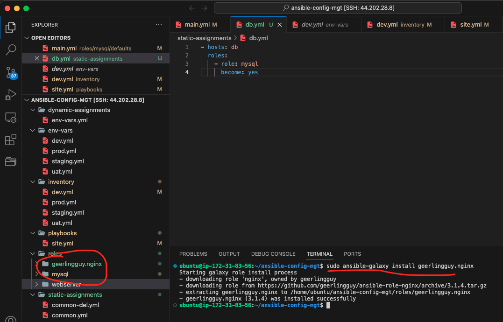

Ran the same process to install Apache expect for changing the nginx to apache.

>
    sudo ansible-galaxy install geerlingguy.apache
    cd roles
    sudo mv geerlingguy.apache/ apache-lb

Now that I have both Nginx and Apache roles, its time to configure both to operate as a loadbalancer.

From the default folder of the `nginx-lb` clicked on the `main.yml`, uncommented and edited the `nginx_upstreams`. Gave the value of the private ip address of the webservers under the servers' settings.

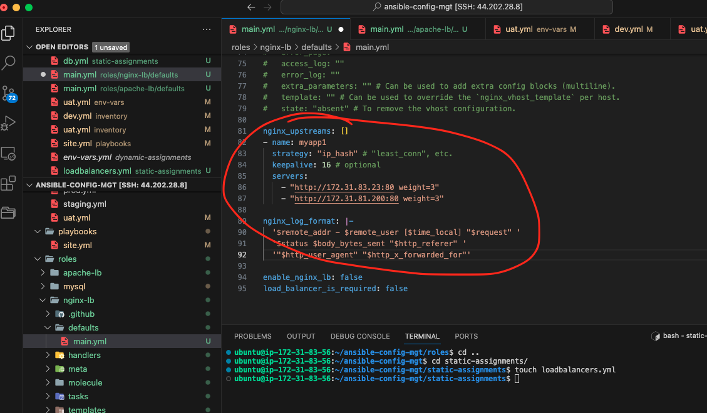

**Important Hints:**

- Since we cannot use both Nginx and Apache load balancer, I added a condition to enable either one - this is where we make use of variables.

- Declared a variable in `defaults/main.yml` file inside the Nginx and Apache roles. Named each v   ariables `enable_nginx_lb` and `enable_apache_lb` respectively.

- Set both values to false like this `enable_nginx_lb: false` and `enable_apache_lb: false`.

- Declared another variable in both roles `load_balancer_is_required` and set its value to `false` as well

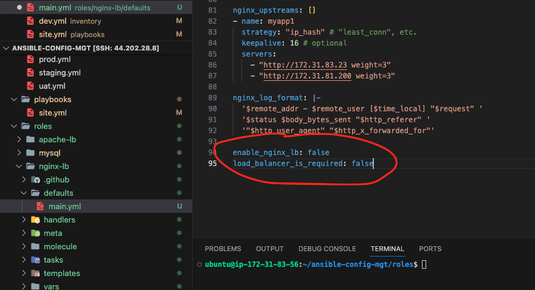

- Repeated the configuration settings for Apache as well. Though the variables and values of apache is a bit different from nginx

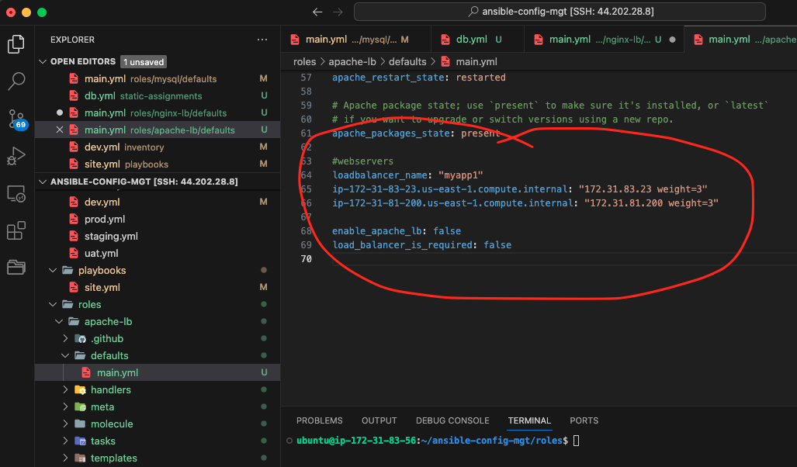

- Update both `static-assignment` and `site.yml` files respectively. Created a `loadbalancers.yml` in the `static-assignment` folder and updated it with 
>
    - hosts: lb
    roles:
        - { role: nginx, when: enable_nginx_lb and load_balancer_is_required }
        - { role: apache, when: enable_apache_lb and load_balancer_is_required }
    become: true

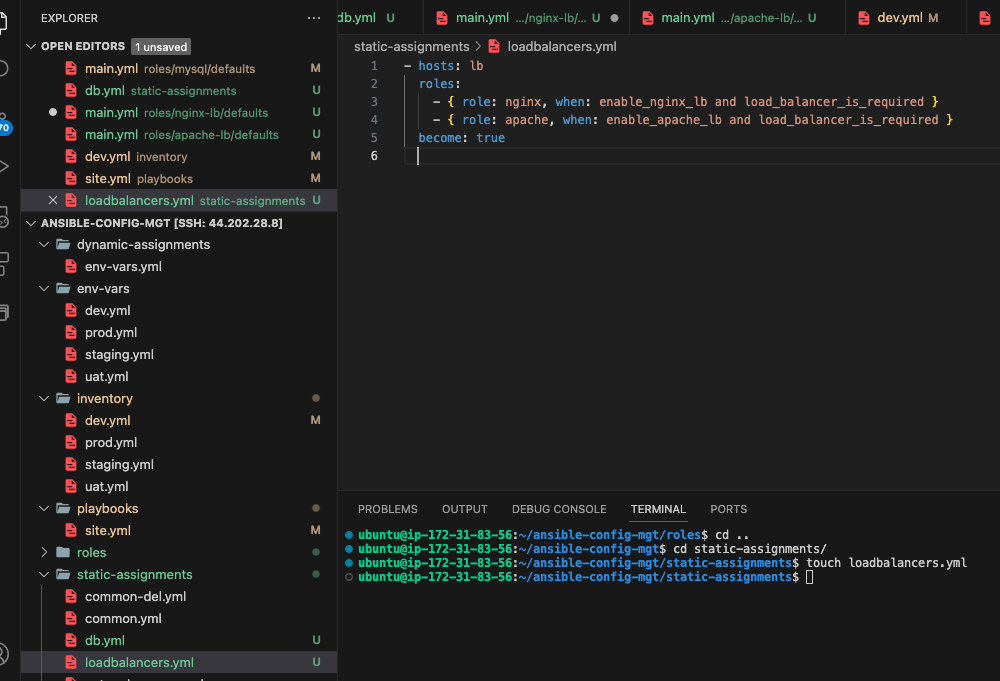

`site.yml` file
>
    - hosts: lb
    - name: Loadbalancers assignment
        
    import_playbook: ../static-assignments/loadbalancers.yml
    when: load_balancer_is_required 

I can now make use of `env-vars\uat.yml` file to define which loadbalancer to use in UAT environment by setting respective environmental variable to true.

I activated load balancer, and enable nginx by setting these in the respective environment's env-vars file.

>
    enable_nginx_lb: true
    load_balancer_is_required: true

The same must work with apache LB, so I can switch it by setting respective environmental variable to true and other to false, i.e

>
    enable_apache_lb: true
    load_balancer_is_required: true

Tested this by updating inventory for each environment and run Ansible against each environment using
>
    ansible-playbook -i inventory/uat.yml playbooks/site.yml

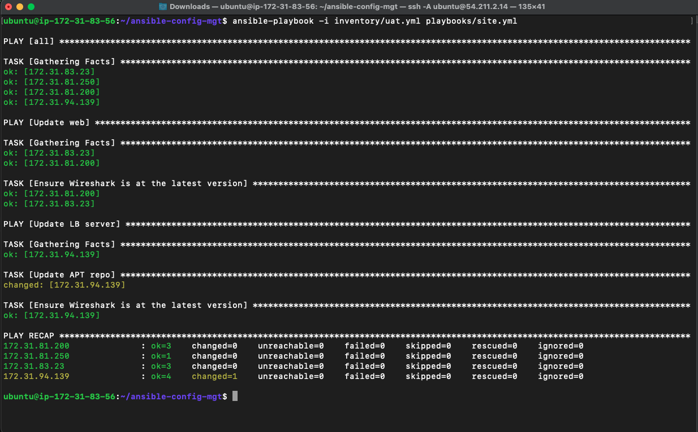

## End of Project