## Documentation for Project 1 
### LAMP Stack (Linux, Apache, MySQL, PHP)

Started this project by creating an Ubuntu Server on AWS. Connected to the instance using 
`ssh -i <private-key-name>.pem ubuntu@<Public-IP-address>`

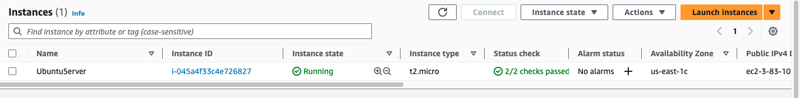

Updated the server using
`sudo apt update`

### Installing Apache Webserver Package

Installed apache webserver software on the server using `sudo apt install apache2`

Verified the package is working; `sudo systemctl status apache2`

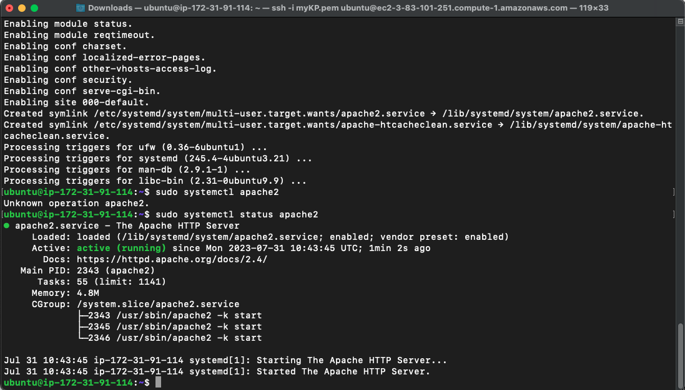

For access to the webserver, added a rule for an inbound connection on the Security group of the instance for a TCP port 80

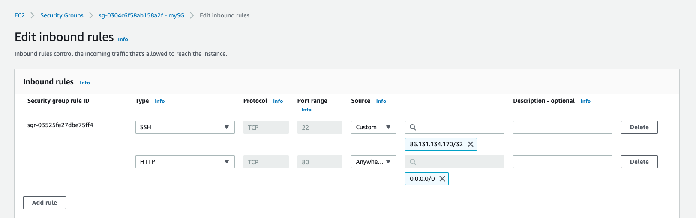

Checked the localhost on the ubuntu server using the command `curl http://localhost:80` or `curl http://127.0.0.1:80` the two commands do the same thing. They both use the *curl* command to request the Apache HTTP Server on port 80.

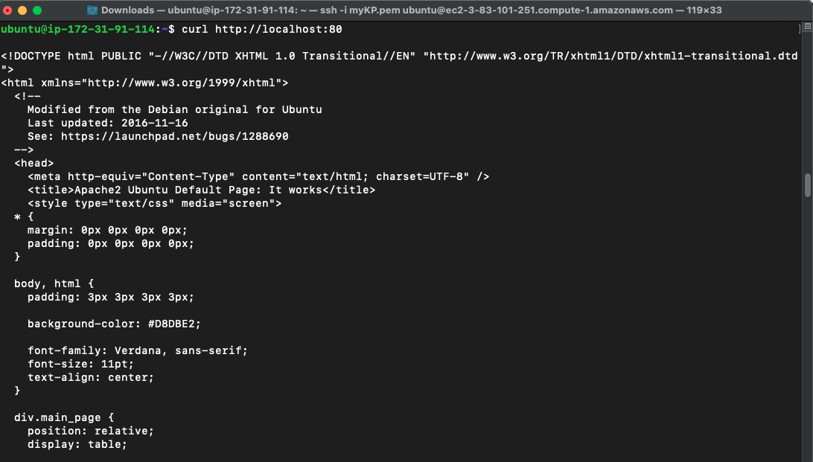

To the request the page on the internet, copied and pasted the public IP address of my instance on a web browser. Because HTTP runs on port 80, there's no need putting the port mapping of *:80*  i.e  3.83.101.251:80 on the web browser.

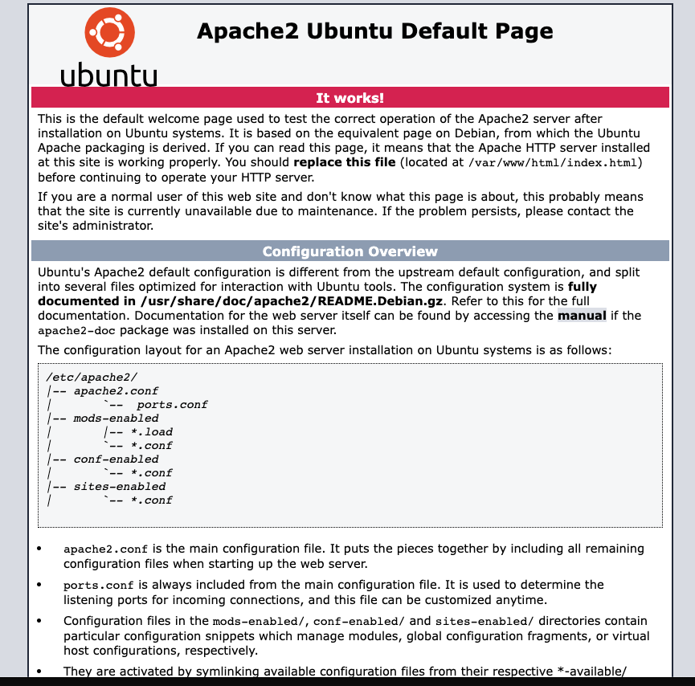

### Installing MySQL Server

Installed MySQL using `sudo apt install mysql-server`

Log in to MySQL server using `sudo mysql`

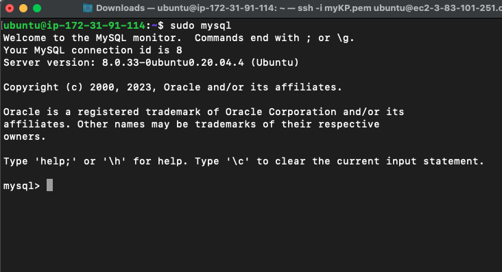

Going to run a security script that comes pre-installed with MySQL.This script will remove some defaut settings and lock down access to my database system. But before running the script I will set a password for the root user, using mysql_native_password as default authentication method. This user's password is defined as `PassWord.1`

And exit MySQL with `exit` command

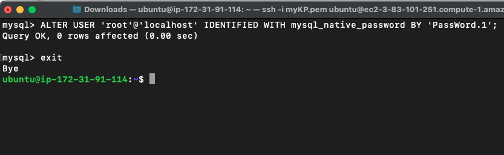

Started the interactive script by running 
`sudo mysql_secure_installation`

Enter the root password `PassWord.1` here

Next I confirmed I am not changing the root password. Typed Y for all other validation.

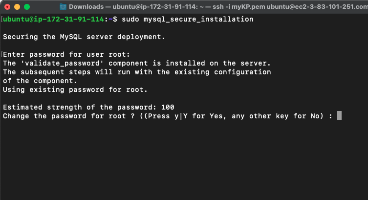

`Remove anonymous users? (Press y|Y for Yes, any other key for No) :`

`Disallow root login remotely? (Press y|Y for Yes, any other key for No) :`

`Remove test database and access to it? (Press y|Y for Yes, any other key for No) :`

`Reload privilege tables now? (Press y|Y for Yes, any other key for No) :`

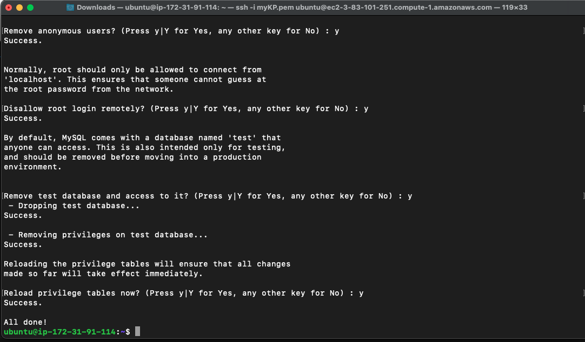

To login with the configured credentials, use
`sudo mysql -p`

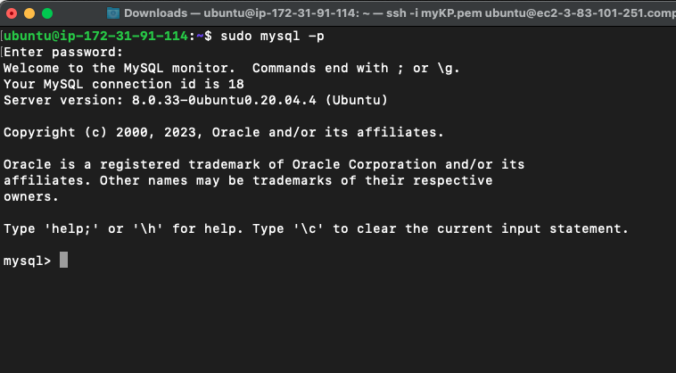

### Installing PHP

Just as Apache is to serve content and MySQL is to store and manage data, PHP is needed as a componet that will process code to display dynamic content to end user. 

A `php-mysql`and `libapache2-mod-php` will be needed along with `php` to be installed. Those two dependencies will allow php to communitcate with MySQL-based databases and enable Apache to handle PHP files respectively.

`sudo apt install php libapache2-mod-php php-mysql` to install PHP and the two dependencies at once.

`php -v` to confirm installation.

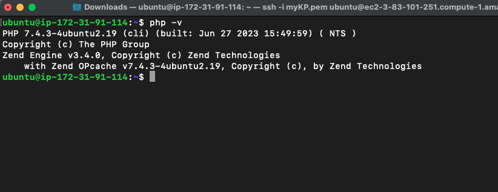

***At this point, LAMP stack is installed and operational.***

### Creating an Apache Virtual Host for website

Created a domain called `projectlamp` by creating a directory for it.

`sudo mkdir /var/www/projectlamp`

Changed ownership of the directory.

`sudo chown -R $USER:$USER /var/www/projectlamp`

Opened a new configuration file in Apache's `site-available` directory.

`sudo vi /etc/apache2/sites-available/projectlamp.conf`

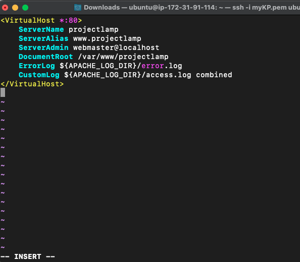

To confirm

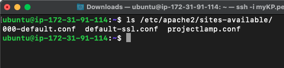

`sudo a2ensite projectlamp` to enable the new virtual host.

`sudo a2dissite 000-default` To disable Apache's default website

Ran `sudo apache2ctl configtest` to make sure the configuration doesn't have syntax error.

Finally reload Apache using `systemctl reload apache2`

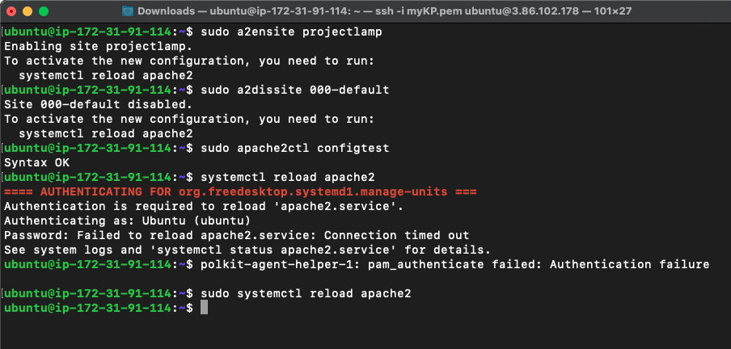

Next, created `index.html` in the directory `/var/www/projectlamp` and pasted 

`sudo echo 'Hello LAMP from hostname' $(curl -s http://169.254.169.254/latest/meta-data/public-hostname) 'with public IP' $(curl -s http://169.254.169.254/latest/meta-data/public-ipv4) > /var/www/projectlamp/index.html` to test the virtual host works as expected.

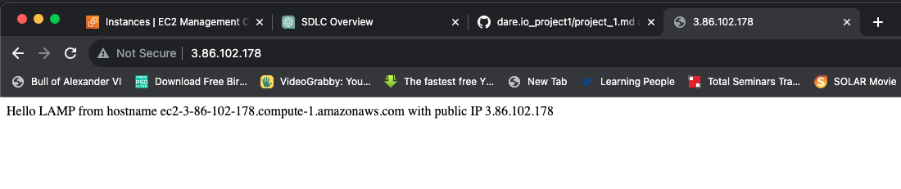

### Enabling PHP on the website

`sudo vim /etc/apache2/mods-enabled/dir.conf` to change the order in which the index.php file is listed within the DirectoryIndex directive

Pasted the below script in the file
>
    <IfModule mod_dir.c>
        #Change this:
        #DirectoryIndex index.html index.cgi index.pl index.php 
        index.xhtml index.htm
        #To this:
        DirectoryIndex index.php index.html index.cgi index.pl 
        index.xhtml index.htm
    </IfModule>

`sudo systemctl reload apache2` to reload Apache

Finally created a PHP script to test that PHP is correctly installed and configured on the server.

Create an `index.php` on the custom web root folder 

`vim /var/www/projectlamp/index.php` and pasted the script below in the file.

> 
    <?php
    phpinfo();

Refreshed the website

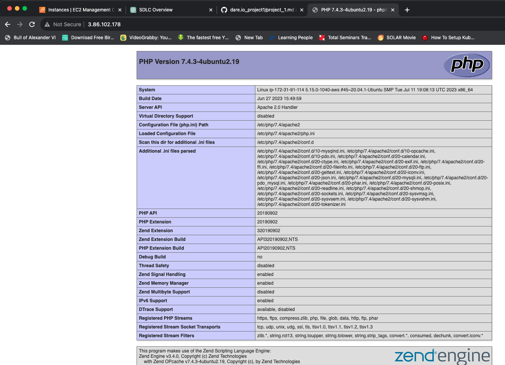

Removed the page using 
`sudo rm /var/www/projectlamp/index.php`