## Linux Practice Projects
This project is designed to pratcice some Linux commands. I will be listing series of commands and screenshots of how it was used and some of the errors encountered.

`sudo apt upgrade`

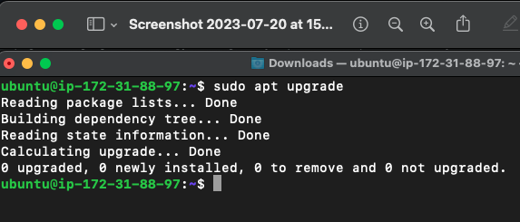

In this screenshot I used commands such as
`mkdir`, `mkdir -p`, to create directory and also to create a recurring directory.
`cd`, `cd -`, `cd ..` to change directory and to change directory to previously visited directory. 
`pwd` list the present working directory.
`touch`, touch with options {1..5} to create an empty files.
`ls`, `ls -a`, `ls -alh` to list the content of a directory or file.
`vi` to edit the content of a file.
`cat` to print on screen the content of a file.

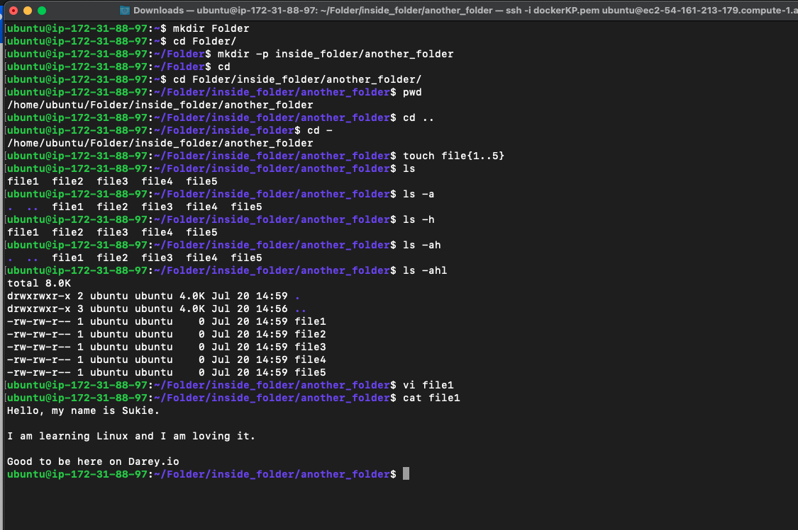

Here I used `cp` to copy files from one directory to the other.
`mv` moved and remnamed files. Made some errors while trying to move multiple files

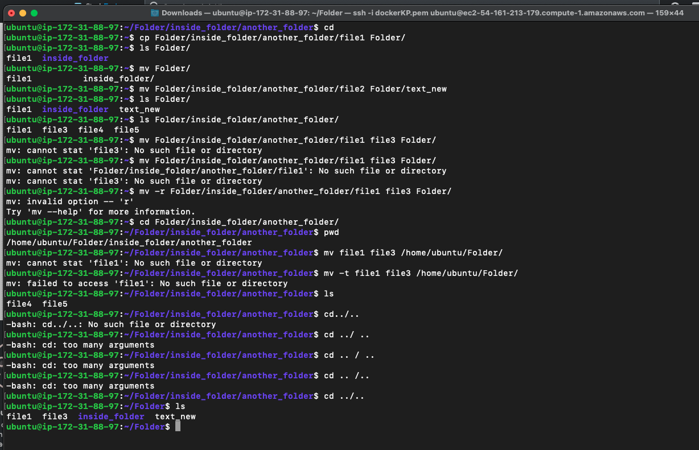

Used `rm` to delete files. `rmdir` to delete directory. `locate` to search for file. `sudo apt install` to install a package that was unavailable

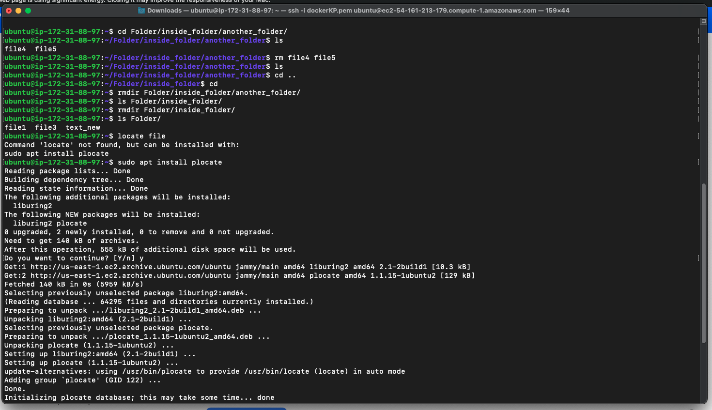

Used `find` to search for a file in a particular directory. `grep` to search for a word in a file.

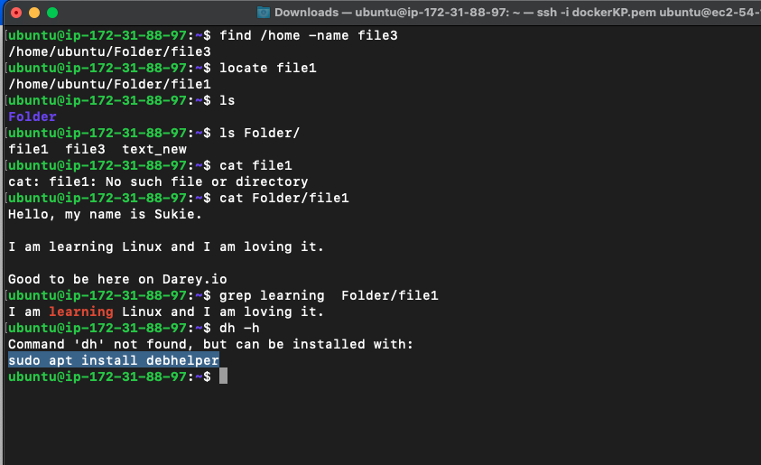

`df _h` to report the disk space useage with the `-h` to print in human readable format.
`du` to check how much spack a file or directory takes up.
`head -3` this allow to view the first 10 line of a file but I used it to display the first 3 line using the -3 option.
`tail -5` Used this to display the last 5 line using the -5 option.
diff Used this to display the difference between the content of two files
`tar -cvf` used this to archive multiple files into a .TAR file

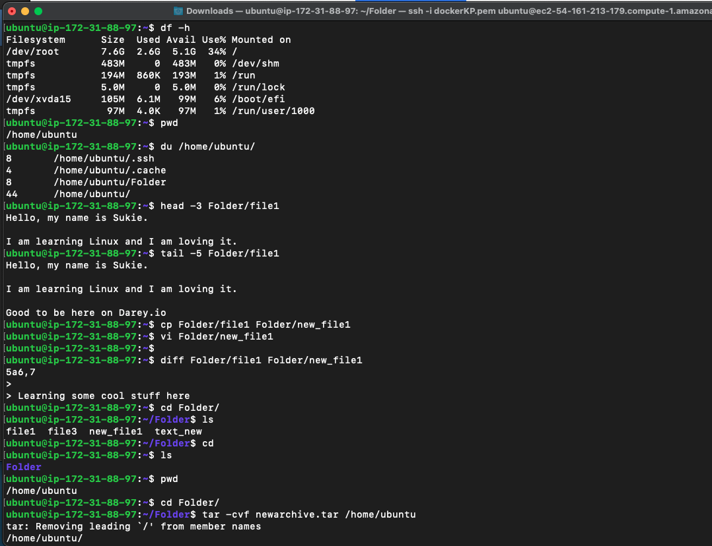

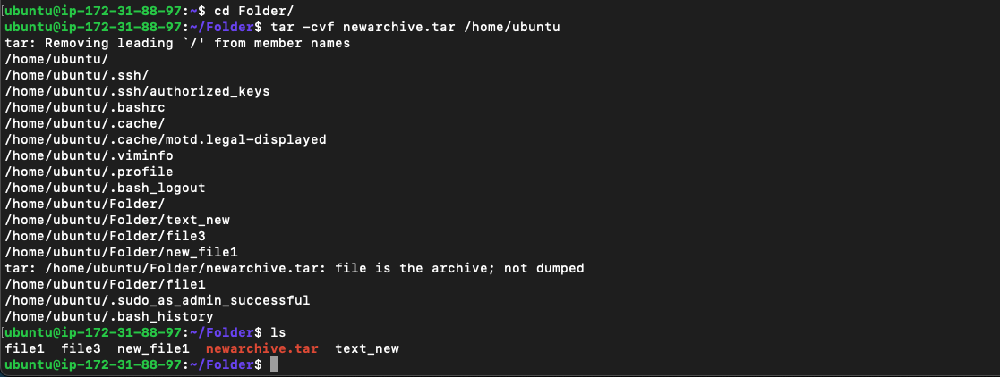

`chmod` to change the read, write and execute permission of a file or directory 
`jobs` For this command to work I created a `sleep job` (sleep 5m &) after I can now use the command to display the current running jobs.  

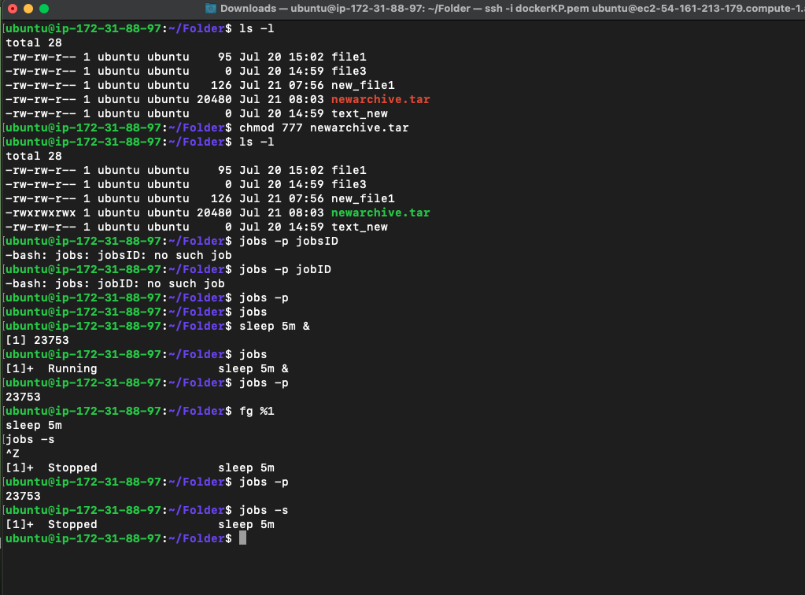

`ping` used this to check the connection of a network
`wget` to download files from the internet

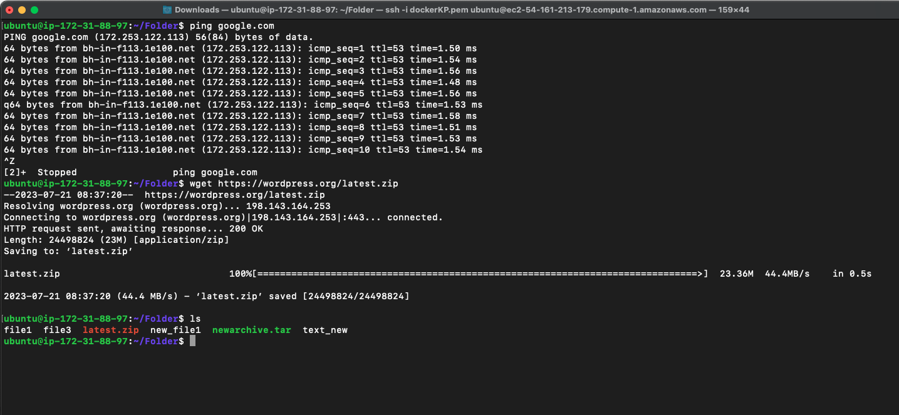

`uname -a`, `uname -s`, `uname -n` was used to display detailed infomation of Linux system including the hardware including the network and IP address.
`top` displays the running process  and also to display the CPU utilization.

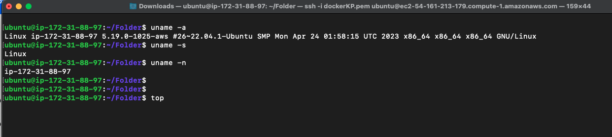

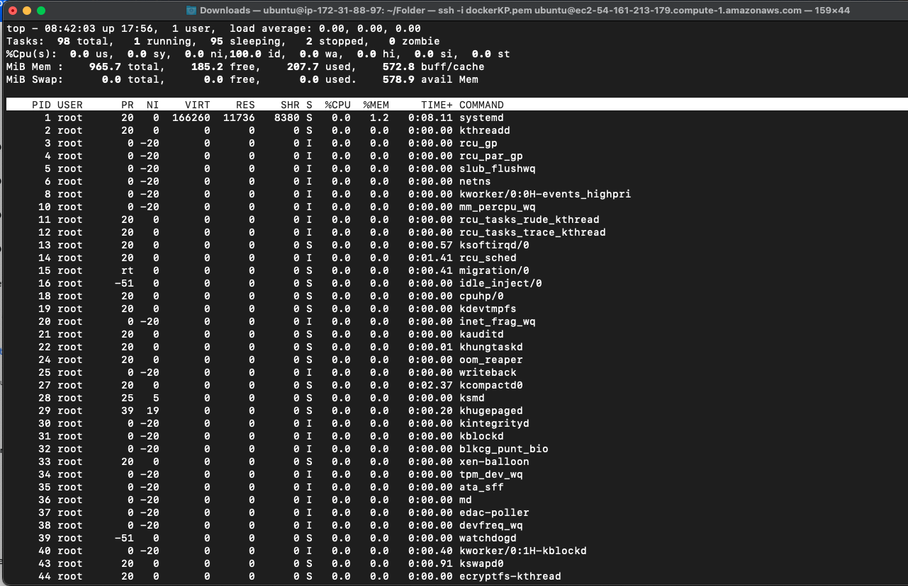

`history` to display all used commands

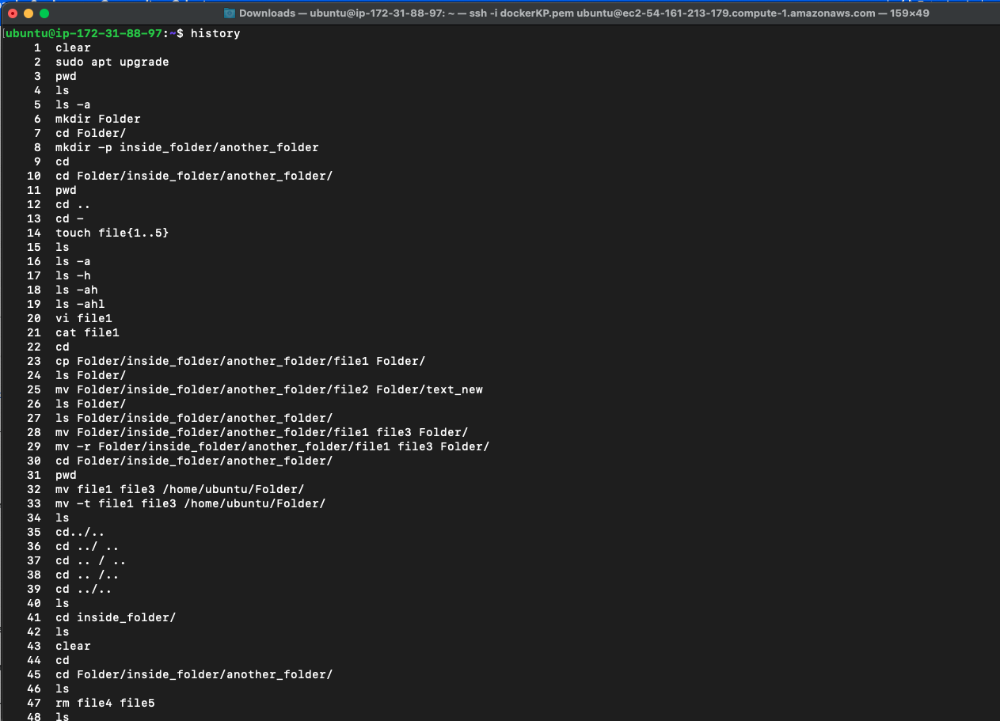

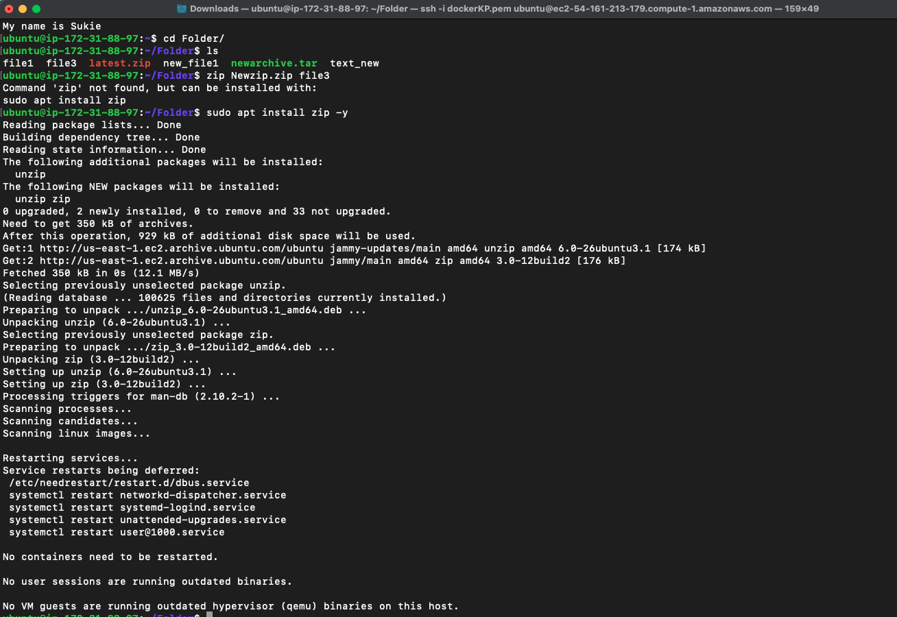

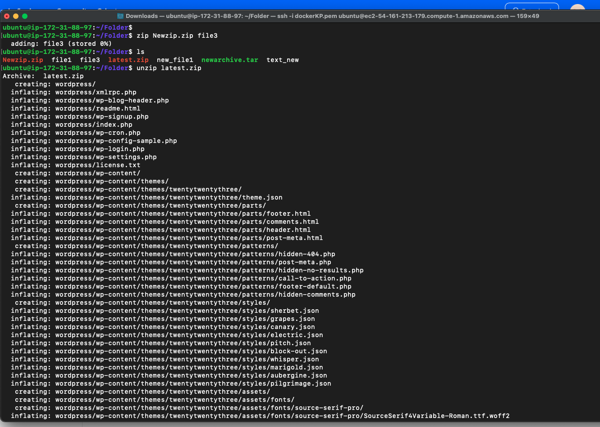

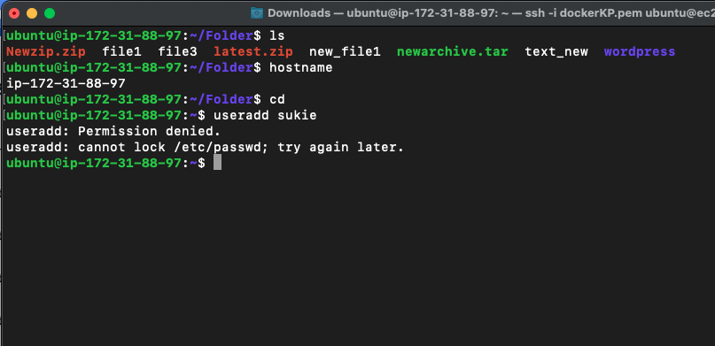

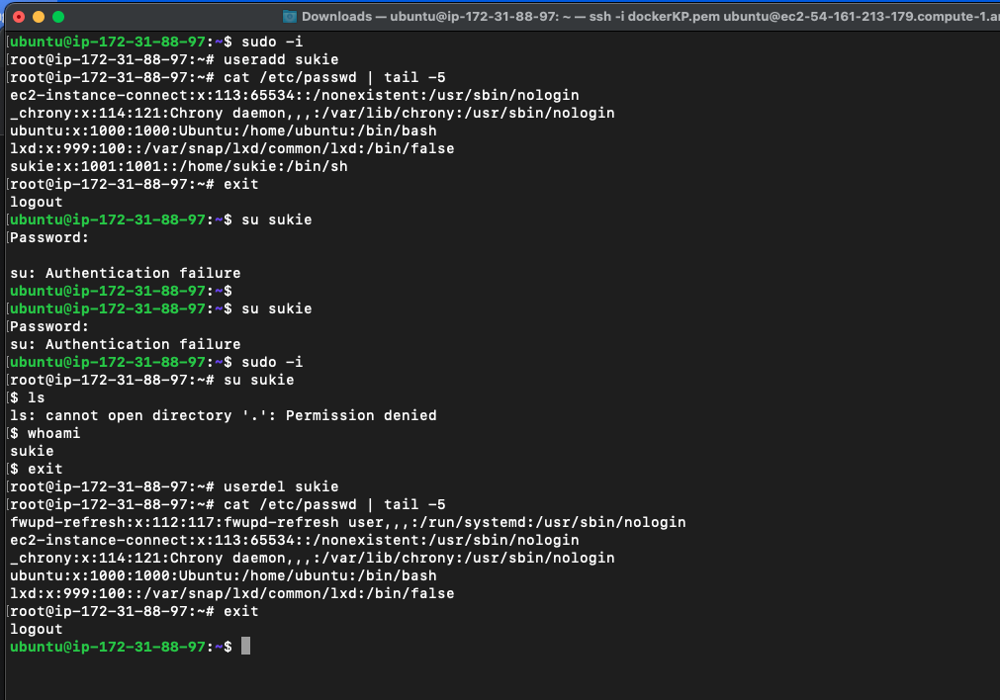

