## Documentation for Project 2
### LEMP Stack (Linux, Nginx, MySQL, PHP)

***In this project I used the Termius as my SSH client***

Created an Ubuntu instance on AWS
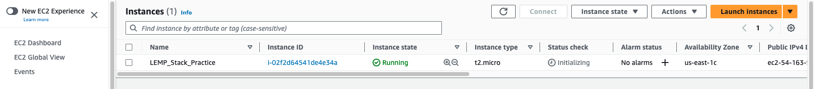

SSH into the account using `ssh -i <Your-private-key.pem> ubuntu@<EC2-Public-IP-address>`

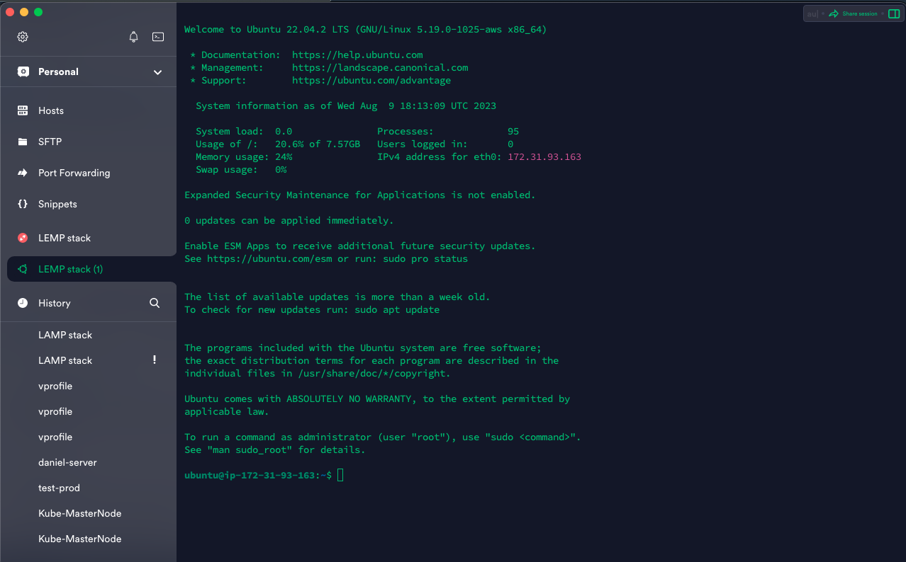

### Installing Nginx Webserver

Updated the server using `sudo apt update` then installed Nginx using `sudo apt install nginx`

To ensure Nginx was correctly installed, ran `sudo systemctl status nginx` to display the status of the webserver.

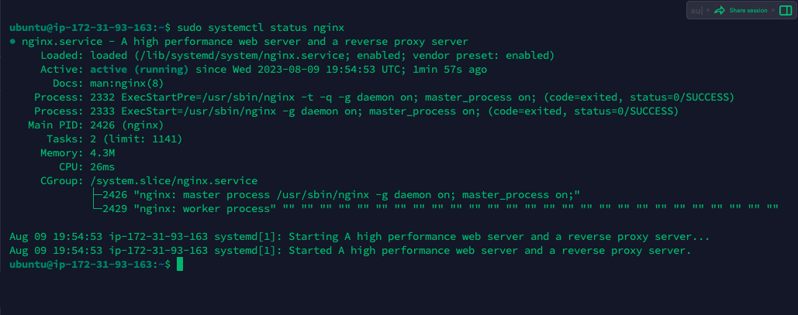

- ***The status shows Nginx is active (running).***

To access the webserver from the web browser, opened a TCP port 80 on security group.

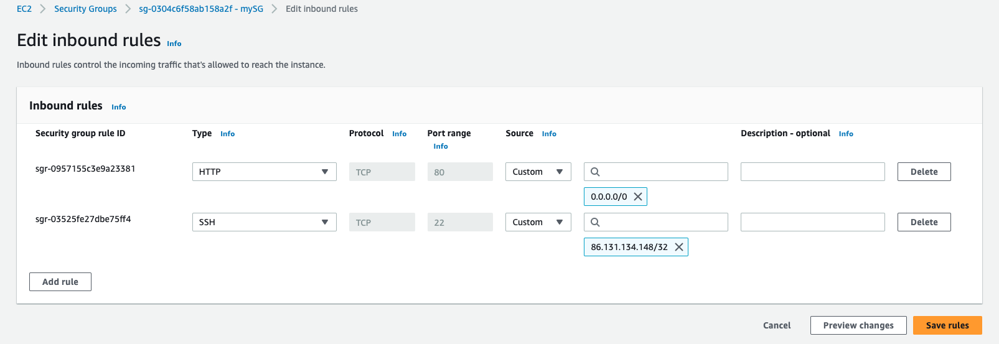

Tested the webserver locally using `curl http://localhost:80`
or `curl http://127.0.0.1:80`

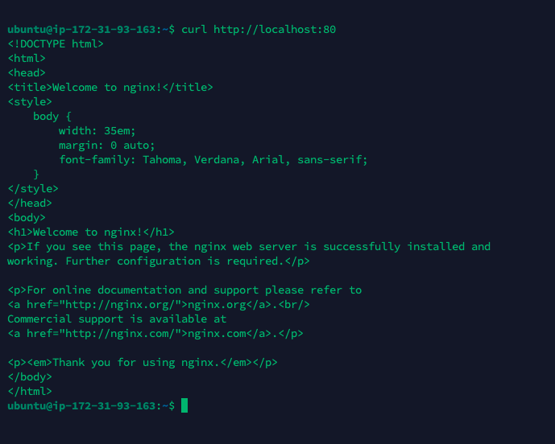

Accessed the webserver using `http://<Public-IP-Address>:80`

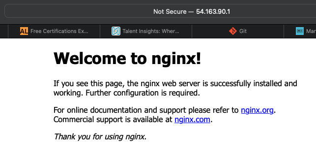

### Installing MySQL

Installed MySQL database using `sudo apt install mysql-server`
and logged in with `sudo mysql` to connect with MySQL Database server

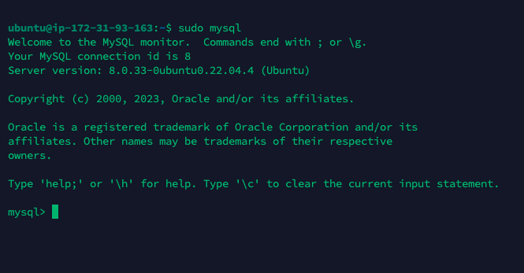

Ran the recommened security script that comes pre-installed with MySQL. The script is to remove some insecure default settings and lock down access to my database system.

First I set a password for the root user, using mysql_native_password as default authentication method. Set the password as `PassWord.1`

I used `ALTER USER 'root'@'localhost' IDENTIFIED WITH mysql_native_password BY 'PassWord.1';` to archeive this.

Then quit MySQL by typing `exit`

Started the interactive script with `sudo mysql_secure_installation`. A series interactive questions were asked, I provided a Yes answer for all.

Now I tested the database using `sudo mysql -p` to ensure thw password I supplied is working.

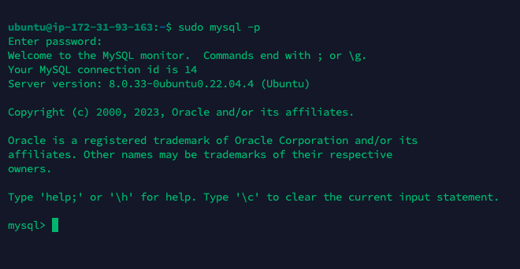 
- ***It worked***

> Note: At the time of this writing, the native MySQL PHP library mysqlnd doesn’t support caching_sha2_authentication, the default authentication method for MySQL 8. For that reason, when creating database users for PHP applications on MySQL 8, you’ll need to make sure they’re configured to use mysql_native_password instead. We’ll demonstrate how to do that in Step 6.

- ***MySQL server is now installed and secured.***

### Installing PHP

Nginx is installed serve my web content and MySQL installed to store and manage data. Will install PHP to process code and genterate dynamic content for the webserver.

Nginx requires an external program to handle PHP processing and act as a bridge between the PHP interpreter iteself and the webserver. This allows for a better overall performace in most PHP based websites, but it requires additional configuration. Will install `php-fpm` and tell Nginx to pass PHP requests to this software for processing. Also will install `php-mysql`, a PHP module that allows PHP to communicate with MySQL-based database. Core PHP packages will automatically be installed as dependencies.

Ran the two packages at once using, `sudo apt install php-fpm php-mysql`

- ***PHP and all dependencies are now installed***

### Configuring Nginx to use PHP Processor
With Nginx we can create server blocks to host multiple domain on a single server. Will use `projectLEMP` as my domain name. The default directory to serve content is `/var/www/html` but will be creating a similar directory structure within the `/var/www/` for my domain website leaving the `/var/www/html` as the default directory to be served if a client request does not match any other sites.

Created the my domain directory using `sudo mkdir /var/www/projectLEMP`.

Next assigned ownership of the directory which will reference the current system user, using `sudo chown -R $USER:$USER /var/www/projectLEMP`

Opened a new configuration file in Nginx's `sites-available` directory using `sudo vim /etc/nginx/sites-available/projectLEMP`

Pasted the code below in the empty file

> 
    #/etc/nginx/sites-available/projectLEMP

    server {
        listen 80;
        server_name projectLEMP www.projectLEMP;
        root /var/www/projectLEMP;

        index index.html index.htm index.php;

        location / {
        try_files $uri $uri/ =404;
        }

        location ~ \.php$ {
        include snippets/fastcgi-php.conf;
        fastcgi_pass unix:/var/run/php/php8.1-fpm.sock;
        }

        location ~ /\.ht {
        deny all;
        }

    }

Activated the configuration by linking to the config file from Nginx's `site-enabled` directory using `sudo ln -s /etc/nginx/sites-available/projectLEMP /etc/nginx/sites-enabled/`

Tested for syntax errors by typing `sudo nginx -t`

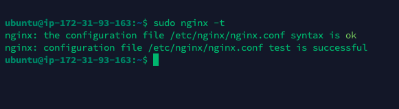

Used `sudo unlink /etc/nginx/sites-enabled/default` to disable default host that is currently configured to listen on port 80.

Now did a systemctl reload `sudo systemctl reload nginx`

Created an `index.html` file in the `/var/www/projectLEMP` directory to test the website.

> 
    sudo echo 'Hello LEMP from hostname' $(curl -s http://169.254.169.254/latest/meta-data/public-hostname) 'with public IP' $(curl -s http://169.254.169.254/latest/meta-data/public-ipv4) > /var/www/projectLEMP/index.html

Tested the page using `http://<Public-IP-Address>:80`

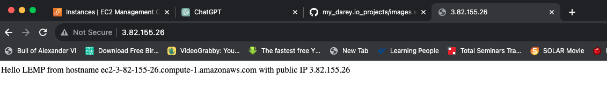

- ***My LEMP stack is now fully configured.***

### Testing PHP with Nginx

Tested the fully operational LEMP stack to ensure Nginx can correctly hand `.php` files off to PHP processor by creating a test PHP file in the document root. Opened a new file called `.info.php` within document root. `sudo vim /var/www/projectLEMP/info.php` and pasted the lines below into the new file. This PHP code will return information about the server.

> 
    <?php
    phpinfo();

Accesed this with `http://server_domain_or_IP/info.php`

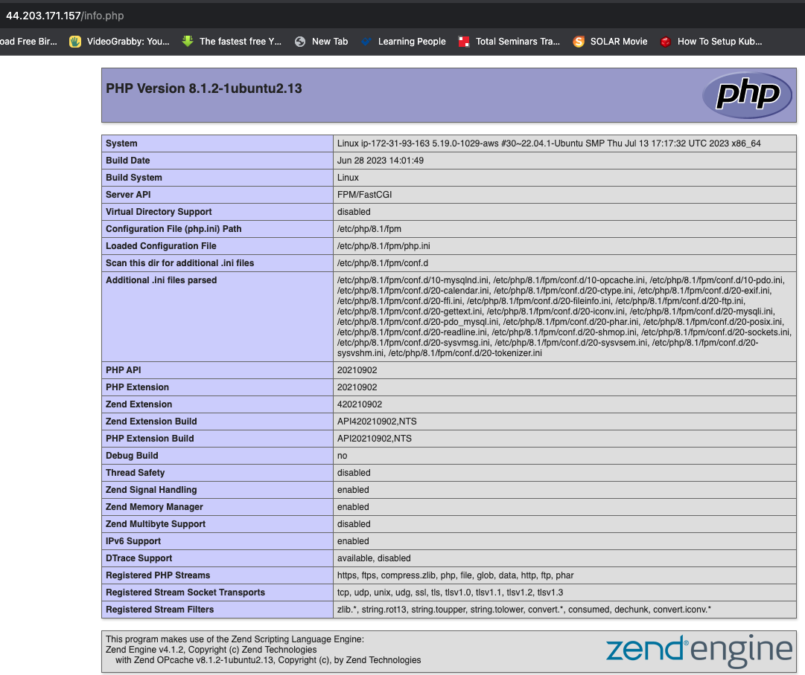

Deleted the file after confirming the page ran. `sudo rm /var/www/projectLEMPinfo.php`

### Retrieving data from MYSQL database with PHP
Here I created a test database(DB) with a simple "To do list".Confirgured access to it so the Nginx website could query from the DB and display it.

Created a new user with `mysql_native_password` authentication method in order to be able to connect to the MySQL database from PHP.

Created a database called `sukie_DB` and user called `SOTech`

Connected to the MySQL console using the root account; `sudo mysql -p` and entered the password provided earlier.

Created a new DB with the following command from MySQL console, `mysql> CREATE DATABASE sukie_DB;`

Granted the new user full privileges on the databese and defining this new user's password. `mysql>  CREATE USER 'SOTech'@'%' IDENTIFIED WITH mysql_native_password BY 'PassWord.1';`

Granted the user permission over the DB using `mysql> GRANT ALL ON sukie_DB.* TO 'SOTech'@'%';`

Then exited the console using `mysql> exit`

Tested the Database by login back in with the new user using `mysql -u SOTech -p`

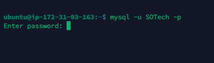

Confirmed access to the database using `mysql> SHOW DATABASES;`

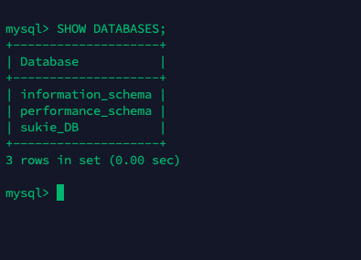

Created a test table named `todo_list` with this command; `CREATE TABLE sukie_DB.todo_list (item_id INT AUTO_INCREMENT,content VARCHAR(255),PRIMARY KEY(item_id));`

Inserted few content into the table using `mysql> INSERT INTO sukie_DB.todo_list (content) VALUES ("My first important item");` then replaced the value of **"My first important item"** 

Confirmed the table was successfully saved using `mysql>  SELECT * FROM sukie_DB.todo_list;`

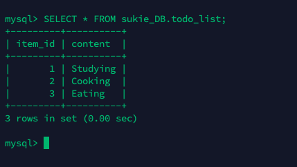

Created a PHP script that connected to MYSQL and query for content after confirming the table was saved successfully using `sudo vim /var/www/projectLEMP/todo_list.php`. Pasted the code below in the file

> 
    <?php
    $user = "example_user";
    $password = "PassWord.1";
    $database = "example_database";
    $table = "todo_list";

    try {
     $db = new PDO("mysql:host=localhost;dbname=$database", $user, $password);
    echo "<h2>TODO</h2><ol>";
    foreach($db->query("SELECT content FROM $table") as $row) {
        echo "<li>" . $row['content'] . "</li>";
    }
    echo "</ol>";
    } catch (PDOException $e) {
        print "Error!: " . $e->getMessage() . " ";
        die();
    }
Accessed the page on the web browser using `http://<Public_domain_or_IP>/todo_list.php`

I believe I got this error message because my database is password protected. 

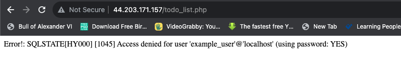