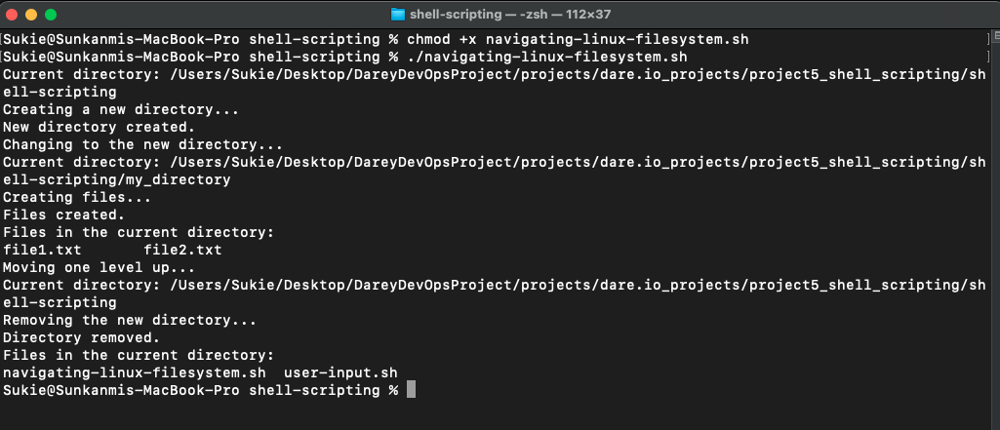
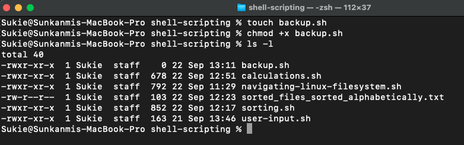

# SHELL SCRIPTING PROJECT

## What is Shell Scripting?
Shell scripting is writing scripts for the command-line interpreter (shell) to automate tasks and execute commands. It involves using scripting languages like Bash, sh, or Zsh to control flow, variables, and functions. Shell scripts handle automation, batch processing, and system command execution for repetitive or complex tasks. They use control structures, variables, and functions to organize and execute sequences of commands. Shell scripting is crucial for system administration, automation, and custom utility creation in Unix-like operating systems.

## Working with Variables
Assigned a value to a variable, such as: `NAME="Sukie"` and that  can be retrieved using `echo $NAME`

## Control Flow
### IF-ELSE Statement
Used *if-else* to execute a script based on a condition to test if a number is either positive, negative or zero. 

Created a `.sh` file named `my_script.sh` 

Gave an execution permission to the file using `chmod +x my_script.sh` and pasted the script below inside the file.
>   
    #!/bin/bash

    # Example script to check if a number is positive, negative, or zero

    read -p "Enter a number: " NUM

    if [ $NUM -gt 0 ]; then
        echo "The number is positive."
    elif [ $NUM -lt 0 ]; then
        echo "The number is negative."
    else
        echo "The number is zero."
    fi
The script prompt to enter a number based on the line  *`read -p "Enter a number: " NUM`*  from the script.

Ran the script using `./my_script.sh`

### FOR-LOOP
Iterating through a list using a *for loop*
>
    #!/bin/bash

    # Example script to print numbers from 1 to 5 using a for loop

    for (( i=1; i<=5; i++ ))
    do
        echo $i
    done

Ran the command `./my_script.sh` 

Output

### Command Substitution
Used backtick for command substitution
> 
    current_date=`date +%Y-%m-%d`
    echo $current_date
 
And also used `$()` syntax for command substitution
> 
    current_date=$(date +%Y-%m-%d)
    echo $current_date

Ran the command `./my_script.sh` for both script and both returned the same output

Output

### Input and Output

Used the `echo` command to output (display) text on the console and also used the `read` to accept input from the user.

>
    echo "Enter your name:"
    read name

Ran the command `./my_script.sh`

Output text to the terminal using `echo` command
>
    echo "Hello World"

Ran the command `./my_script.sh`

Redirected the output of a command to a file using the operator "`>`" 
> 
    echo "hello world" > index.txt

Passed the content of the file as input to a command
>
    grep "pattern" < index.txt

Passed the result of the command as input to another command

>
    echo "hello world" | grep "pattern"

 And `<` to input from a file. Piped the output of one command as input to another using the `|` sign.

### FUNCTIONS
Used the Functions to group related commands together. This function is used to greet the user.
> 
    #!/bin/bash

    # Define a function to greet the user
    greet() {
    echo "Hello, $1! Nice to meet you."
    }

    # Call the greet function and pass the name as an argument
    greet "Sukie"

Ran the command `./my_script.sh`

## Writting First Shell Script

### Step 1 

Created a directory with `mkdir shell-scripting`

### Step 2
Changed the directory into the newly created one, using `cd shell-scripting`. While in the newly created directory, created a script file using `touch user-input.sh`.

### Step 3
Saved the below block of code in the file using `vim user-input.sh`
>
    #!/bin/bash

    # Prompt the user for their name
    echo "Enter your name:"
    read name

    # Display a greeting with the entered name
    echo "Hello, $name! Nice to meet you."

This script prompt the user for their name and in return displays the text of greeting on the screen.

### Step 4
Saved the file in vim using `:wq!`

### Step 5
Grant an executable permission on the file using `chmod +x user-input.sh`

### Step 6
Ran the script using the command `./user-input.sh`

## Directory Manipulation and Navigation
This script will display the current directory, create a new directory called `my_directory`, change to that directory, create two files inside it, list the files and move back one level up. It will remove the `my_directory` and its contents, and list the files in the current directory again.

### Step 1
Created a file named `navigating-linux-filesystem.sh` using `touch navigating-linux-filesystem.sh`

### Step 2
Pasted the code below into the file
>
    #!/bin/bash

    # Display current directory
    echo "Current directory: $PWD"

    # Create a new directory
    echo "Creating a new directory..."
    mkdir my_directory
    echo "New directory created."

    # Change to the new directory
    echo "Changing to the new directory..."
    cd my_directory
    echo "Current directory: $PWD"

    # Create some files
    echo "Creating files..."
    touch file1.txt
    touch file2.txt
    echo "Files created."

    # List the files in the current directory
    echo "Files in the current directory:"
    ls

    # Move one level up
    echo "Moving one level up..."
    cd ..
    echo "Current directory: $PWD"

    # Remove the new directory and its contents
    echo "Removing the new directory..."
    rm -rf my_directory
    echo "Directory removed."

    # List the files in the current directory again
    echo "Files in the current directory:"
    ls

### Step 3
Gave the file an executable permission using `chmod +x navigating-linux-filesystem.sh`

### Step 4
Ran the script using the command `./navigating-linux-filesystem.sh`

## File Operations and Sorting
Here I will be focusing on file operationg and sorting. Will be writing a script which creates files, displays the files in their current order, sorts them alphabetically, saves the sorted files abd displays the sorted files. This script removes the original files, rename the sorted file and finally displays the contents of the final sorted file.

### Step1 
Created a file named `sorting.sh` using the command `touch sorting.sh`

### Step 2
Opend the created file using `vim sorting.sh` and pasted the below block of code.
>
    #!/bin/bash

    # Create three files
    echo "Creating files..."
    echo "This is file3." > file3.txt
    echo "This is file1." > file1.txt
    echo "This is file2." > file2.txt
    echo "Files created."

    # Display the files in their current order
    echo "Files in their current order:"
    ls

    # Sort the files alphabetically
    echo "Sorting files alphabetically..."
    ls | sort > sorted_files.txt
    echo "Files sorted."

    # Display the sorted files
    echo "Sorted files:"
    cat sorted_files.txt

    # Remove the original files
    echo "Removing original files..."
    rm file1.txt file2.txt file3.txt
    echo "Original files removed."

    # Rename the sorted file to a more descriptive name
    echo "Renaming sorted file..."
    mv sorted_files.txt sorted_files_sorted_alphabetically.txt
    echo "File renamed."

    # Display the final sorted file
    echo "Final sorted file:"
    cat sorted_files_sorted_alphabetically.txt

### Step 3
Gave the file and executable permission using the command `chmod +x sorting.sh`

### Step 4
Ran the script using `./sorting.sh`

## Working with Numbers and Calculations
This script will define two variables num1 and num2 with numeric values, perform basic arithmetic operations and displays the result. It will also perform more complaex calculations such as raising num1 to the power of 2 and calculating the square root of num2 and displays the results.

### Step 1
Created a file using the `touch` command, `touch calculations.sh`

### Step 2
Saved the below block of code in the created file.
>
    #!/bin/bash

### Step 3
Set an executable permission on the creted file using `chmod +x calculations.sh`

### Step 4
Ran the script using the command `./calculations.sh`

## File Backup and Timestamping
Created a script that defines the source directory and backup the directory paths. It then creates a timestamp using the current date and time, creates a backup directory with the timestamp appended to its name. The script then copies all the files from the source directory to the backup directory using the `cp` command with the `-r` option for recusive copying. It finally displays a massage indicating the completion of the backup process and shows the path of the backup directory with the timestamp.

### Step 1
Created a script file using `touch backup.sh`

### Step 2
Pasted the below block of code in the file.
>
    #!/bin/bash

    # Define the source directory and backup directory
    source_dir="/path/to/source_directory"
    backup_dir="/path/to/backup_directory"

    # Create a timestamp with the current date and time
    timestamp=$(date +"%Y%m%d%H%M%S")

    # Create a backup directory with the timestamp
    backup_dir_with_timestamp="$backup_dir/backup_$timestamp"

    # Create the backup directory
    mkdir -p "$backup_dir_with_timestamp"

    # Copy all files from the source directory to the backup directory
    cp -r "$source_dir"/* "$backup_dir_with_timestamp"

    # Display a message indicating the backup process is complete
    echo "Backup completed. Files copied to: $backup_dir_with_timestamp"

### Step 3
Gave the file a execuatble permission using the command `chmod +x backup.sh`

### Step 4
Ran the script using the command `./backup.sh`

