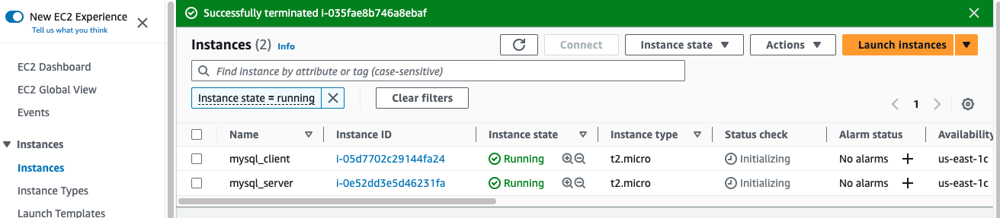
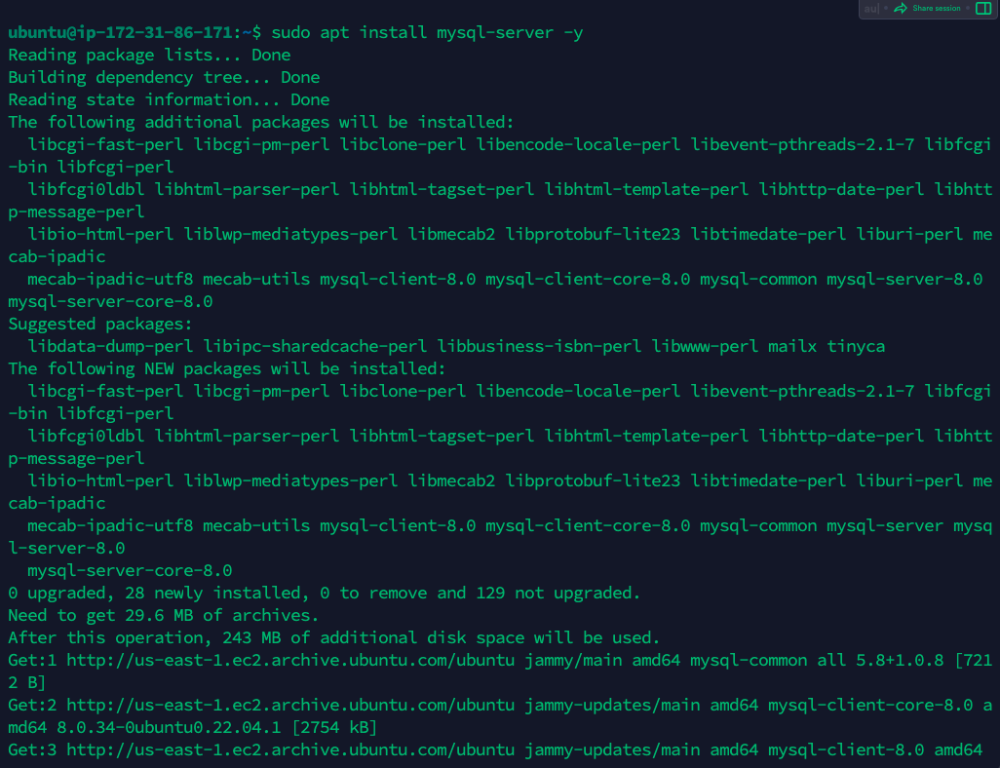
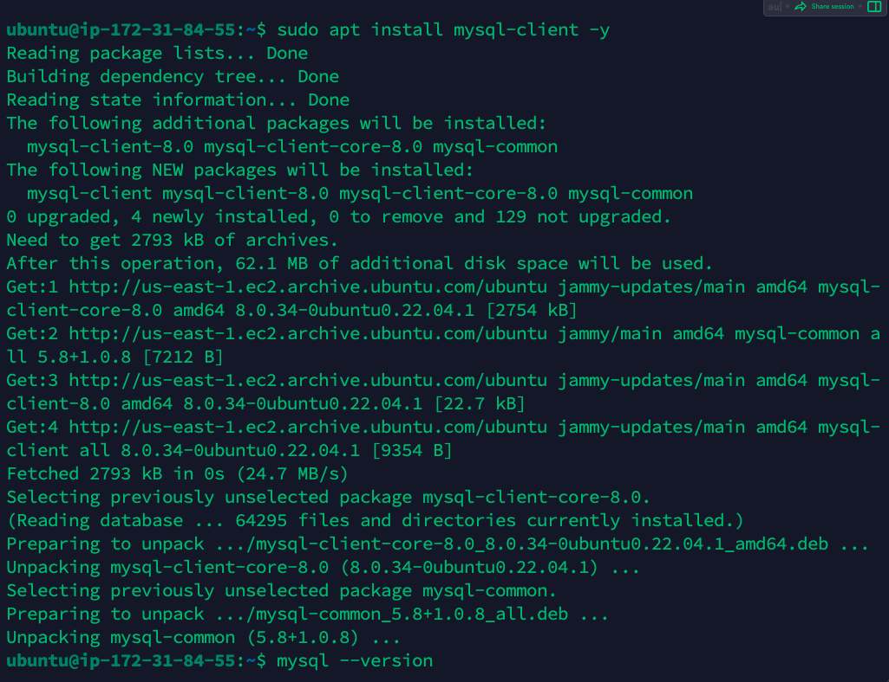
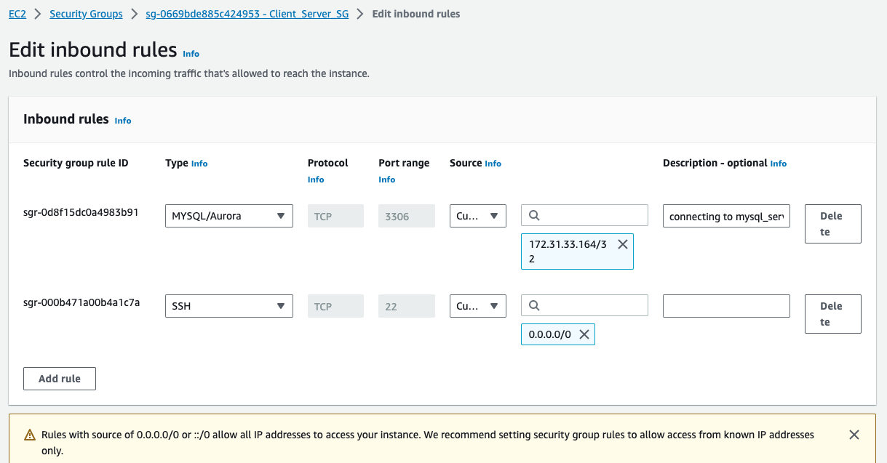
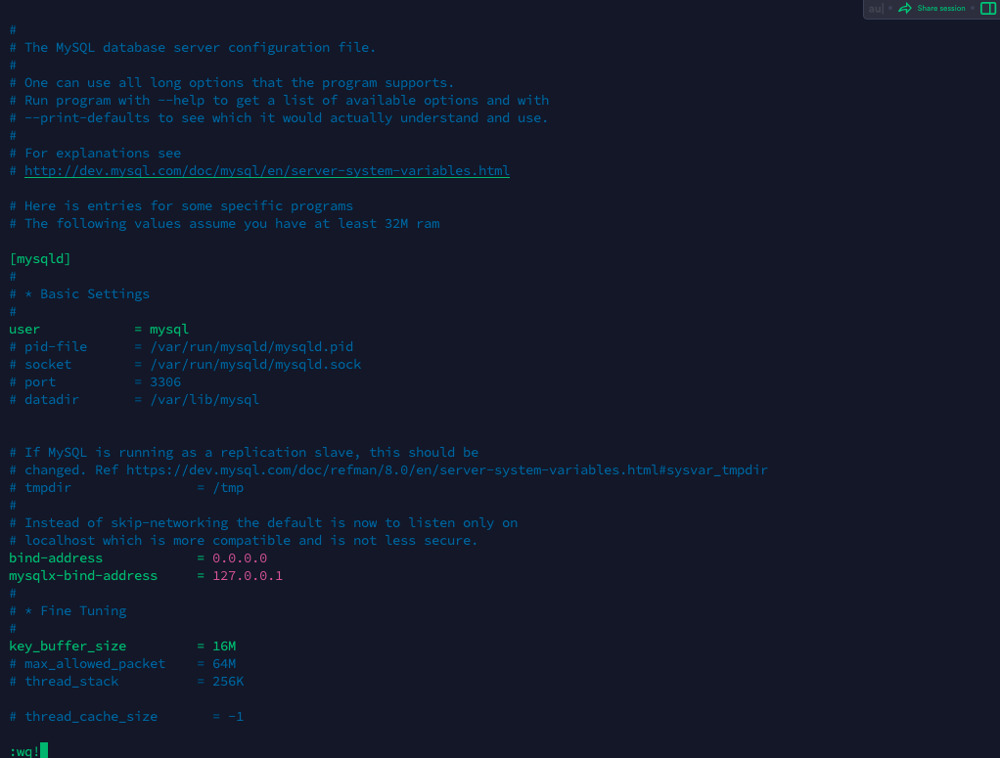
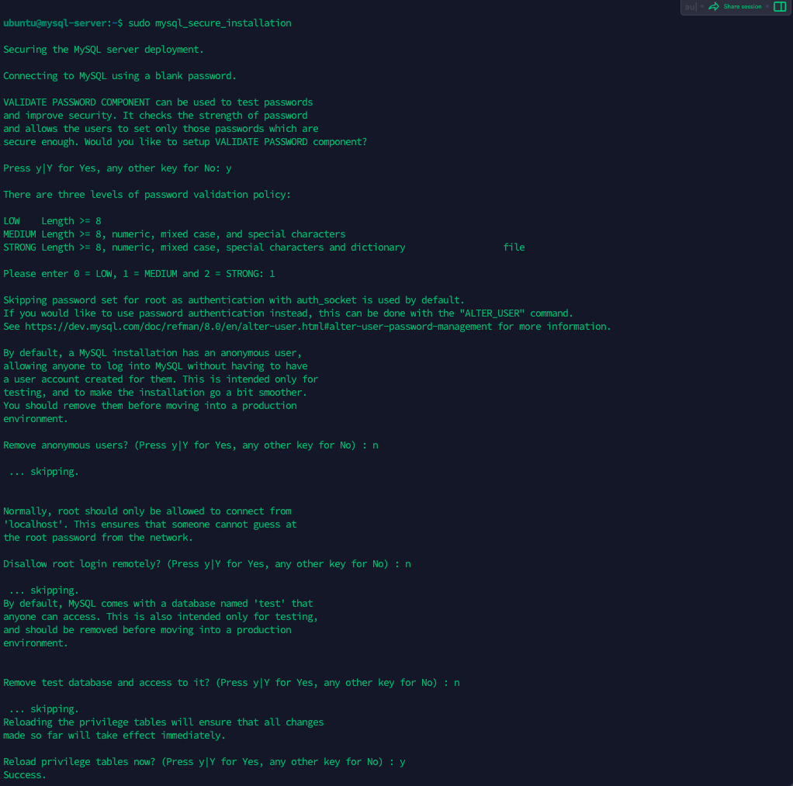
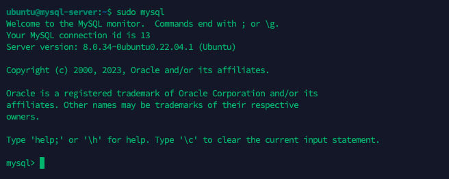
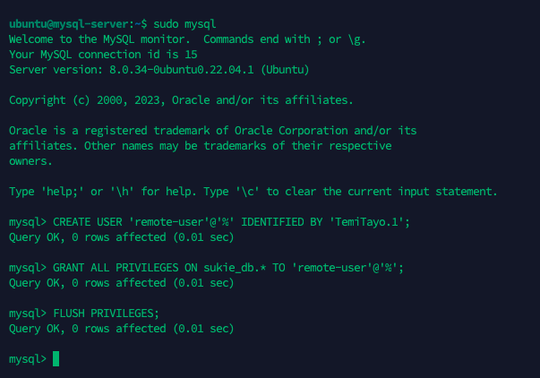
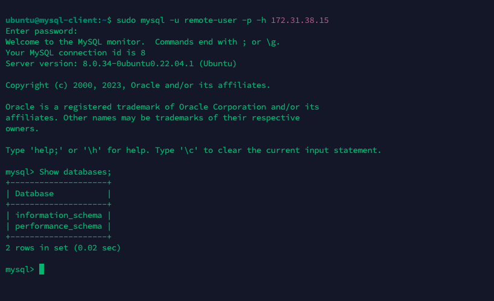

# Implemented a Client-Server Architecture using MySQL Database Management System (DBMS).

## TASK
Implement a Client-Server Architecture using MySQL Database Management System (DBMS) without SSH.

### Implementation
1. Created two EC2 instances in AWS with a keypair `mysql_KP`
    - Instance A name `mysql_server`
    - Instance B name `mysql_client`

2. On *Instance A* `mysql_server` installed MySQL Server Software using the command
> 
                sudo apt install mysql-server -y

3. On *Instance B* `mysql_client` installed MySQL Client Software using the command:
    >
                sudo apt install mysql-client

4. Opened a TCP port `3306` on the inbound security group to allow connection to `mysql_server` by allowing connection from the private IP address of `mysql_client` only.

5. Configured Instance A `mysql_server` to allow connections from remote host by editing the `mysqld.cnf` file, and replaced the the bind-address from `127.0.0.1` to `0.0.0.0` using the command:

    >
        sudo vi /etc/mysql/mysql.conf.d/mysqld.cnf 

6. Connecting from `mysql_client` machine to `mysql_server` Database Engine remotely without using `SSH`.

### Step 1
Secured the MYSQL database on the `mysql_server` using the command below and followed the instruction on the screen to validate password for more security.

    
                sudo mysql_secure_installation

### Step 2
Logged into the Database using 

>
                        sudo mysql

### Step 3
Created a user and a password using the command

>
        CREATE USER 'remote-user'@'%' IDENTIFIED BY 'TemiTayo.1';

Where *`remote-user` is the username for the database and `TemiTayo.1` is the password.*

### Step 4
With the command below, named the database `sukie_db` and granted the user with privileges to the database using the command: 

>
        GRANT ALL PRIVILEGES ON sukie_db.* TO 'remote-user'@'%';

### Step 5
Updated the changes made to the database using the command:
>
                        FLUSH PRIVILEGES;

### Step 6
Restarted `mysql_server` using 
>
                sudo systemctl restart mysql

7. From the machine `mysql_client`, connected to the the server `mysql_server` remotely using the command 

>
        sudo mysql -u remote-user -p -h 172.31.38.15

*`172.31.38.15` is the private IP address of `mysql_server`*

