# Implementing Loadblancers with Nginx

## TASK

-   Provision two EC2 instances running ubuntu 22.04 and install apache webserver in them. 
-   Open port 8000 to allow traffic from anywhere. 
-   Update the default page of the webservers to display their public IP address.
-   Provision another EC2 instance running ubuntu 22.04 with Nginx installed on it and configure it as a loadblancer distributing traffic across the webservers.

## Implementation
### Step 1
Provisioned two ubuntu 22.04 EC2 instances
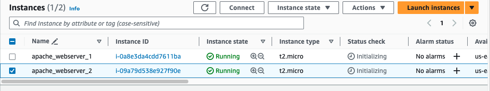

### Step 2
Opened port 8000 of the security group to allow traffic from anywhere
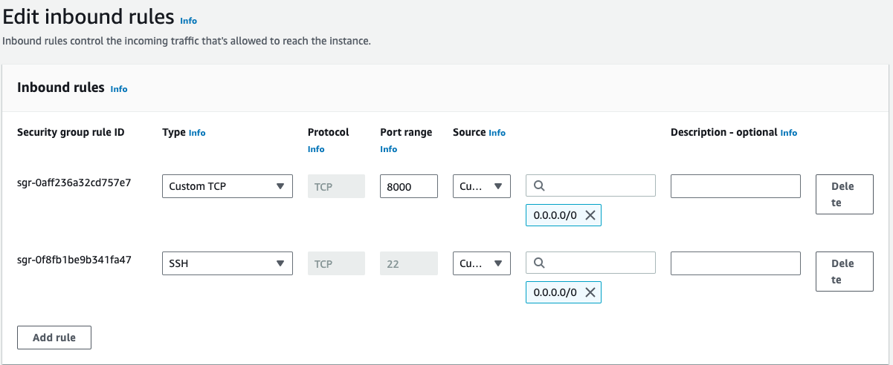

### Step 3
Connected to the instances via SSH using Termius. Updated the server and installed Apache on both instances using the command
>
         sudo apt update -y && sudo apt install apache2 -y

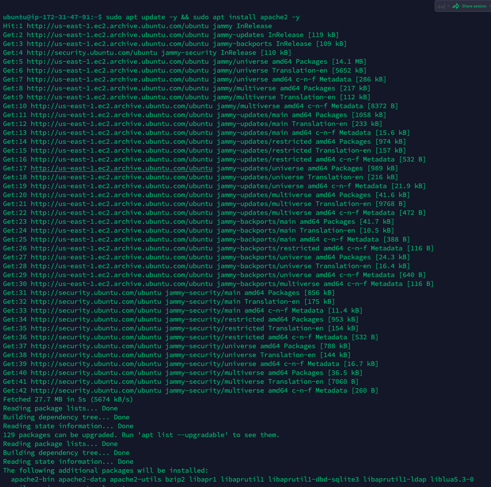

Verified Apache is running using `sudo systemctl status apache2`
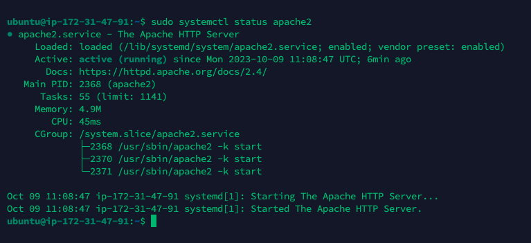

### Step 4
Configured Apache to serve a page showing its public IP. First I confirgued Apache to serve content on port 8000 instead of the default port 80. Then created a new index.html file containing a code to display the public IP of the EC2 instance. Lastly override the default html file with the new html file.
- Configuring Apache to serve content on port 8000
1.  Edited the file `/etc/apache2/ports.conf` using
>
                 sudo vim /etc/apache2/ports.conf
2.  Added a new listen directive for port 8000
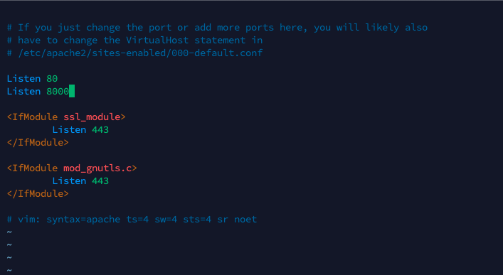

3.  Opened the file `/etc/apache2/sites-available/000-default.conf` and changed the port 80 on the virtualhost to 8000.
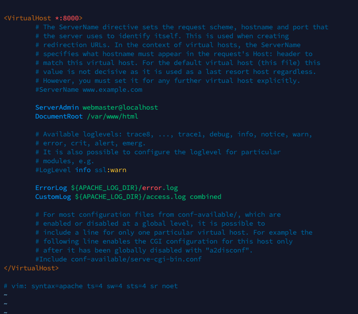

4.  Restart Apache to load the new configuration using the command
>
    sudo systemctl restart apache2

### Step 5
- Created a new html file using `sudo vim index.html` and pasted the below html code
>
            <!DOCTYPE html>
        <html>
        <head>
            <title>My EC2 Instance</title>
        </head>
        <body>
            <h1>Welcome to my EC2 instance</h1>
            
Public IP: YOUR_PUBLIC_IP

        </body>
        </html>

*Replacing "YOUR_PUBLIC_IP" with  my instance public IP address*

- Changed the ownership of the index.html file with the command 
>
                sudo chown www-data:www-data ./index.html

### Step 6
Overriding the default html file of Apache webserver
- Replaced the default html file with the new html file using the command
>   
            sudo cp -f ./index.html /var/www/html/index.html

- Restarted the webserver to load the new configuration with the command `sudo systemctl restart apache2`

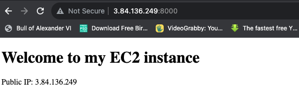

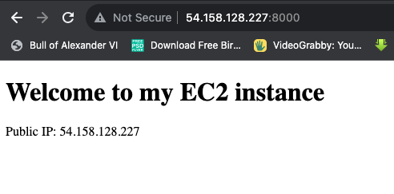

## Configuring Nginx as a Loadblancer
### Step 1
- Provisioned a new ubuntu 22.04 EC2 instance with port 80 opened on the security group to allow traffic from anywhere.
- SSH into the instance updated and installed Nginx using 
>
            sudo apt update -y && sudo apt install nginx -y 

- Confirmed nginx is running using `sudo systemctl status nginx`
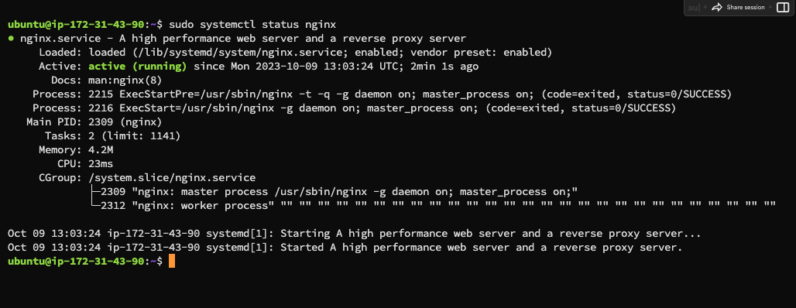

### Step 2
Configured Nginx by opening a `loadbalancer.conf` file using 
>
         sudo vi /etc/nginx/conf.d/loadbalancer.conf

Pasted the below configuration in the file
>
            
        upstream backend_servers {

            # your are to replace the public IP and Port to that of your webservers
            server 127.0.0.1:8000; # public IP and port for webserser 1
            server 127.0.0.1:8000; # public IP and port for webserver 2

        }

        server {
            listen 80;
            server_name <your load balancer's public IP addres>; # provide your load balancers public IP address

            location / {
                proxy_pass http://backend_servers;
                proxy_set_header Host $host;
                proxy_set_header X-Real-IP $remote_addr;
                proxy_set_header X-Forwarded-For $proxy_add_x_forwarded_for;
            }
        }
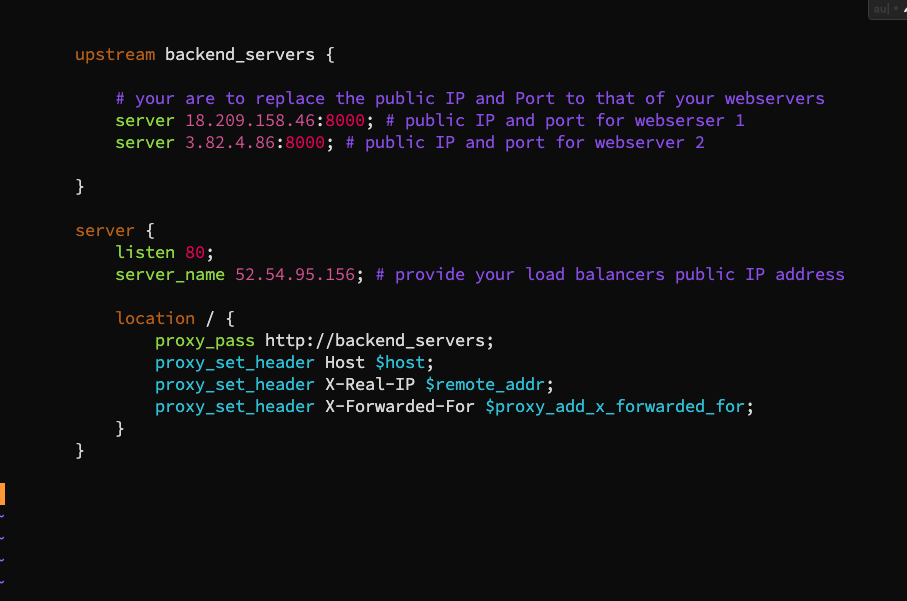    
*Note*
- `Upstream backend_servers` defines a group of backend servers. The server line in the upstream block list the addresses and ports of the backend servers.
- `proxy_pass` inside the `location` block sets up the loadblancing, passing the requests to the backend servers.
- `proxy_set_header` passes necessary headers to backend servers to correctly handle the requests.

### Step 3
Tested the configuration using
>
                        sudo nginx -t
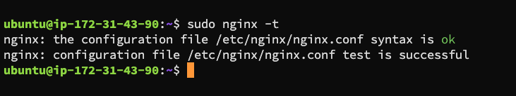

### Step 4
Restarted Nginx with `sudo systemctl restart nginx`

### Step 5
Pasted the public IP address of the Nginx server on a web browser
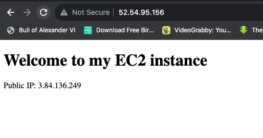

### Project completed 