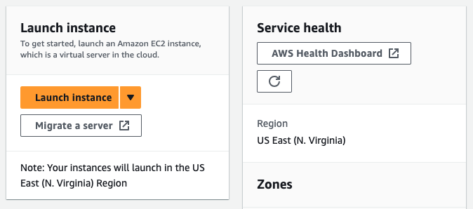
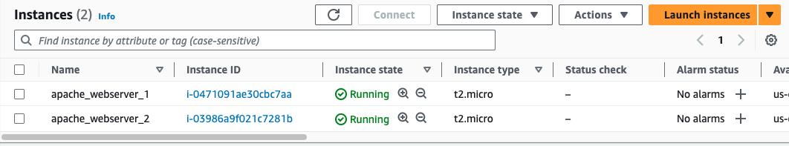
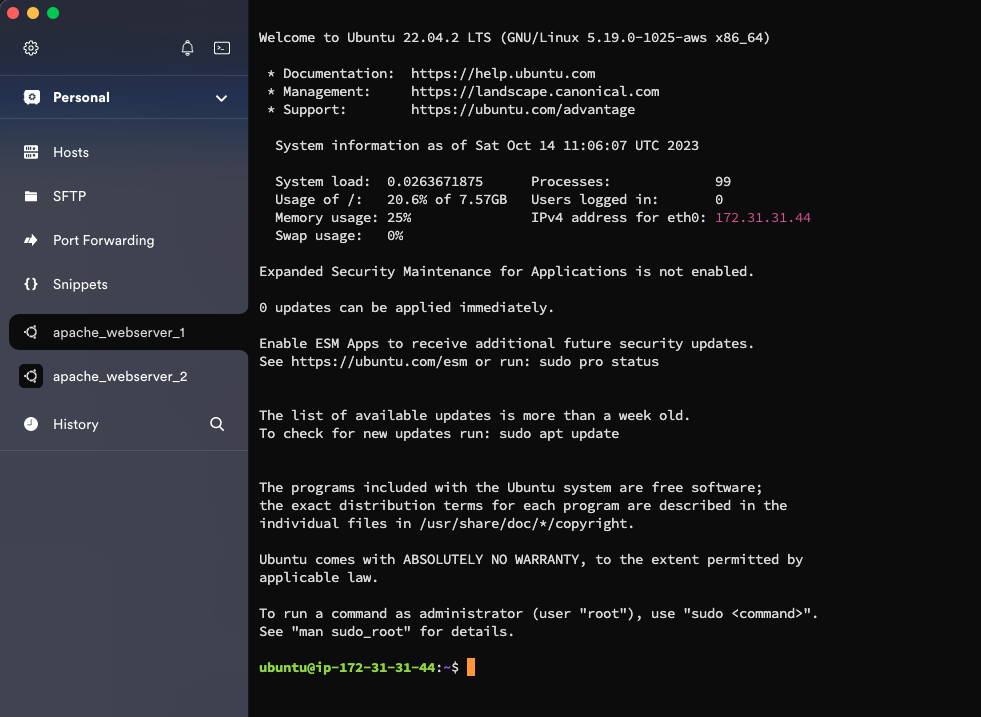
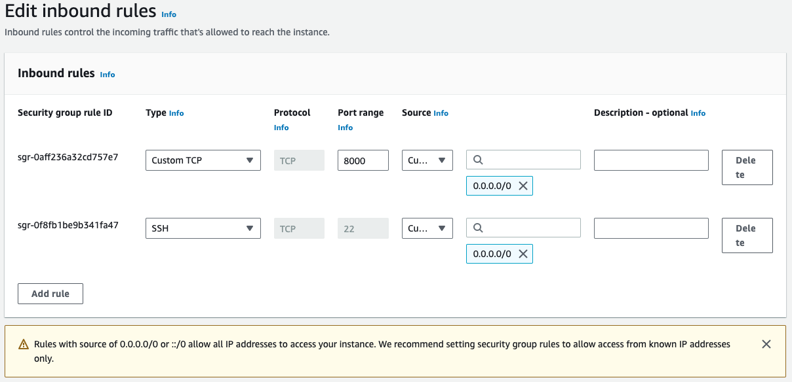
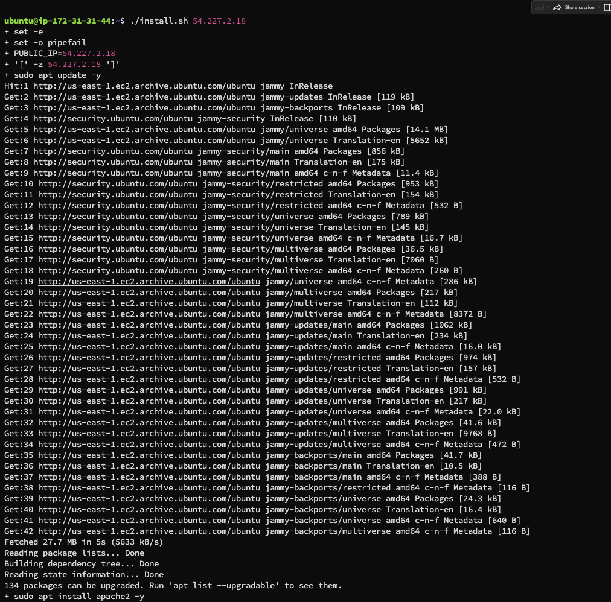
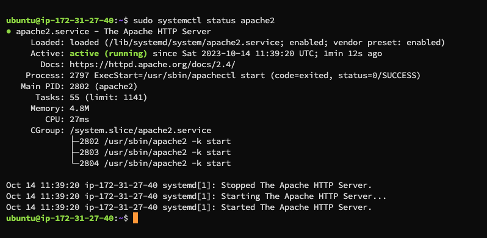
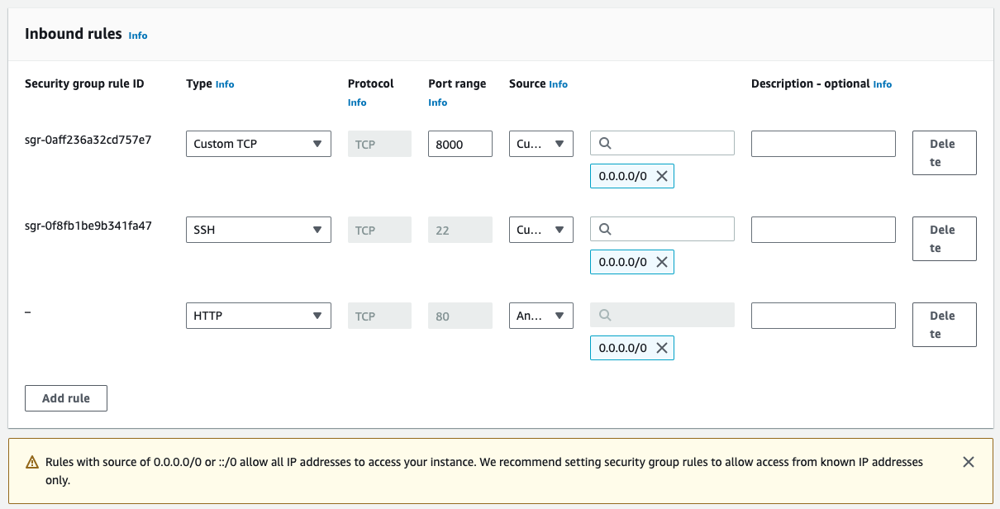
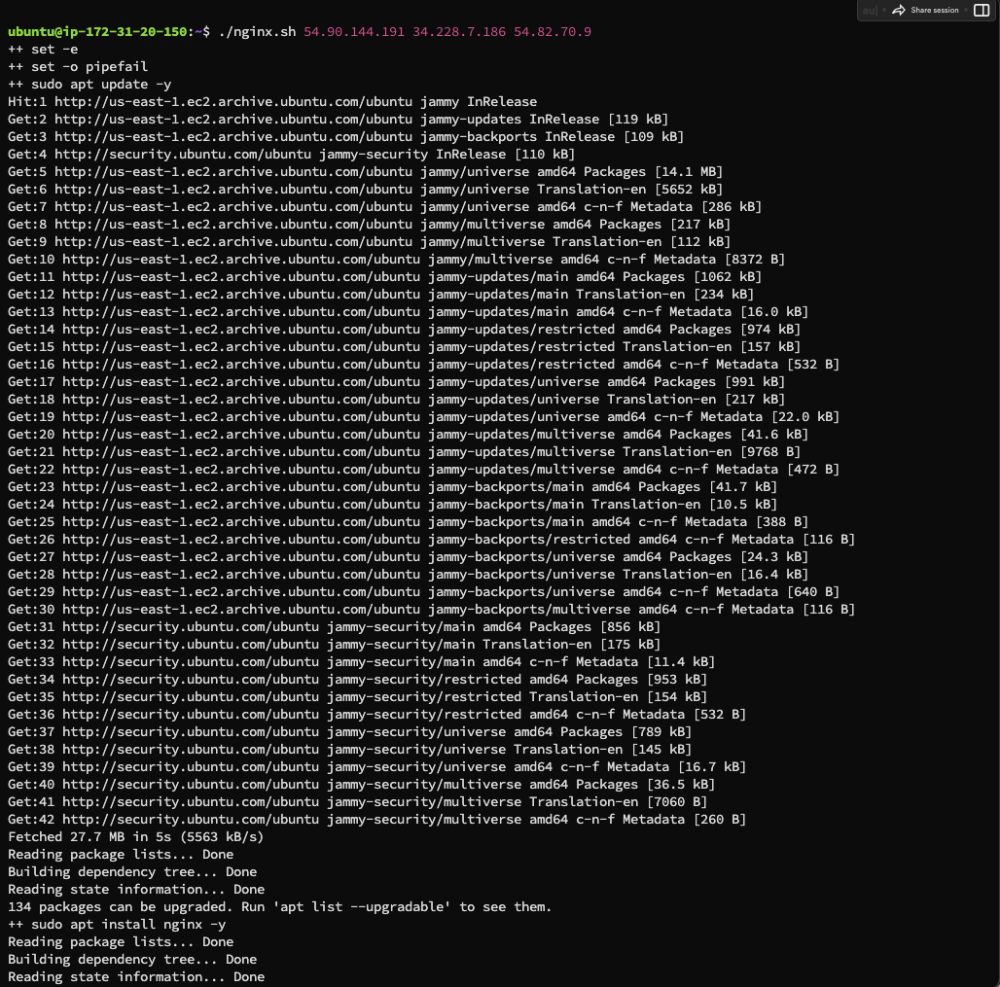
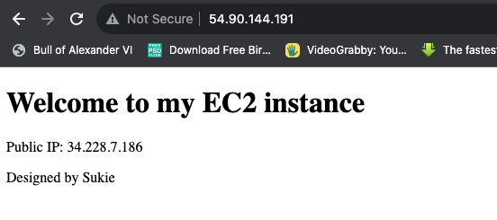
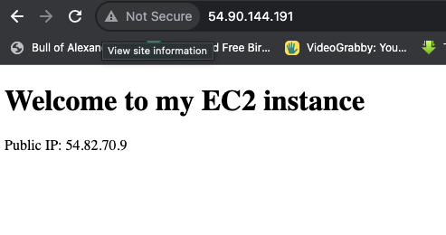

# Automating Loadbalancer Configuration With Shell Scripting
## Task
Automate Loadbalacer configuration with Nginx using shell scripting, which distributes network traffic across two webservers. 

## Implementation 
- Deployed two EC2 instances running Ubuntu 22.04.
- Automated the installation, deployment and configuration of Apache Webservers using shell script on the instances.
- Deployed a single EC2 instance running Ubuntu 22.04.
- Installed and configured Nginx as a Loadbalancer using shell script on the instance.

### Step 1
## Deploying and configuring the two Apache webservers
### Provisioned two EC2 instances running ubuntu 20.04
- From the EC2 Dashboard of AWS, clicked on the `Launch Instance` button

    

- Connected to the two instances seperately using Termius as my SSH client.

- Opened a port 8000 to allow traffic from anywhere using the security group.

- Created a shell script file named *install.sh* using `sudo vim install.sh` pasted a the script below in that file.
>
    #!/bin/bash

    ####################################################################################################################
    ##### This automates the installation and configuring of apache webserver to listen on port 8000
    ##### Usage: Call the script and pass in the Public_IP of your EC2 instance as the first argument as shown below:
    ######## ./install_configure_apache.sh 127.0.0.1
    ####################################################################################################################

    set -x # debug mode
    set -e # exit the script if there is an error
    set -o pipefail # exit the script when there is a pipe failure

    PUBLIC_IP=$1

    [ -z "${PUBLIC_IP}" ] && echo "Please pass the public IP of your EC2 instance as an argument to the script" && exit 1

    sudo apt update -y &&  sudo apt install apache2 -y

    sudo systemctl status apache2

    if [[ $? -eq 0 ]]; then
        sudo chmod 777 /etc/apache2/ports.conf
        echo "Listen 8000" >> /etc/apache2/ports.conf
        sudo chmod 777 -R /etc/apache2/

        sudo sed -i 's/<VirtualHost \*:80>/<VirtualHost *:8000>/' /etc/apache2/sites-available/000-default.conf

    fi
    sudo chmod 777 -R /var/www/
    echo "<!DOCTYPE html>
            <html>
            <head>
                <title>My EC2 Instance</title>
            </head>
            <body>
                <h1>Welcome to my EC2 instance</h1>
                
Public IP: "${PUBLIC_IP}"

            </body>
            </html>" > /var/www/html/index.html

    sudo systemctl restart apache2

- Gave the file an executable permission using `sudo chmod +x install.sh`

*Note*
The above script automates the installation and configuration of apache webserver to listen on port 8000. It also setup a webpage which displays the IP address of the webservers. This script is executed by passing the public IP address of the server as an argument. 

- Ran the script using `./install.sh public_ip_address`

- Confirmed Apache is running and enabled using `sudo systemctl status apache2`

### Step 2
## Deployment of Nginx as a Load Balancer using Shell Script
- Provisioned an EC2 instance running Ubuntu 22.04.
- Opened port 80 to anywhere using the security group.

- Connected to the instance using Termius as the SSH Client.
- Opened a shell script file named *nginx.sh* using `sudo vim nginx.sh`
- Pasted the below shell script to install and configure Nginx as a loadbalancer in the file opened
>

    #!/bin/bash

    ######################################################################################################################
    ##### This automates the configuration of Nginx to act as a load balancer
    ##### Usage: The script is called with 3 command line arguments. The public IP of the EC2 instance where Nginx is installed
    ##### the webserver urls for which the load balancer distributes traffic. An example of how to call the script is shown below:
    ##### ./configure_nginx_loadbalancer.sh PUBLIC_IP Webserver-1 Webserver-2
    #####  ./configure_nginx_loadbalancer.sh 127.0.0.1 192.2.4.6:8000  192.32.5.8:8000
    ############################################################################################################# 

    PUBLIC_IP=$1
    firstWebserver=$2
    secondWebserver=$3

    [ -z "${PUBLIC_IP}" ] && echo "Please pass the Public IP of your EC2 instance as the argument to the script" && exit 1

    [ -z "${firstWebserver}" ] && echo "Please pass the Public IP together with its port number in this format: 127.0.0.1:8000 as the second argument to the script" && exit 1

    [ -z "${secondWebserver}" ] && echo "Please pass the Public IP together with its port number in this format: 127.0.0.1:8000 as the third argument to the script" && exit 1

    set -x # debug mode
    set -e # exit the script if there is an error
    set -o pipefail # exit the script when there is a pipe failure

    sudo apt update -y && sudo apt install nginx -y
    sudo systemctl status nginx

    if [[ $? -eq 0 ]]; then
        sudo touch /etc/nginx/conf.d/loadbalancer.conf

        sudo chmod 777 /etc/nginx/conf.d/loadbalancer.conf
        sudo chmod 777 -R /etc/nginx/

        
        echo " upstream backend_servers {

                # your are to replace the public IP and Port to that of your webservers
                server  "${firstWebserver}"; # public IP and port for webserser 1
                server "${secondWebserver}"; # public IP and port for webserver 2

                }

            server {
                listen 80;
                server_name "${PUBLIC_IP}";

                location / {
                    proxy_pass http://backend_servers;   
                }
        } " > /etc/nginx/conf.d/loadbalancer.conf
    fi

    sudo nginx -t

    sudo systemctl restart nginx

*Note*
The above script takes the IP address of the Nginx server, webserver 1, webserver 2 as an argument when running the command to execute the script.

- Closed the file by typing `ESC :wqa!`
- Gave the file an executable permission using `sudo chmod +x nginx.sh`
- Ran the script with the command `./nginx.sh nginx_server_IP webserver_1_IP webserver_2_IP`

- Pasted the public ip address of the loadbalancer on a web browser to confirm its working.

Project completed!!