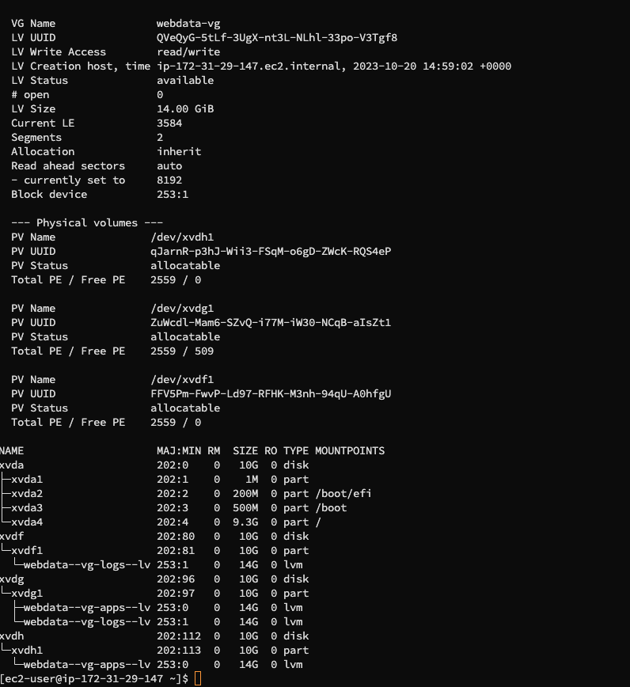
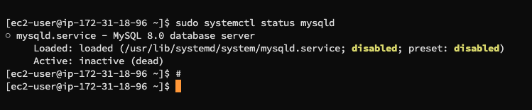
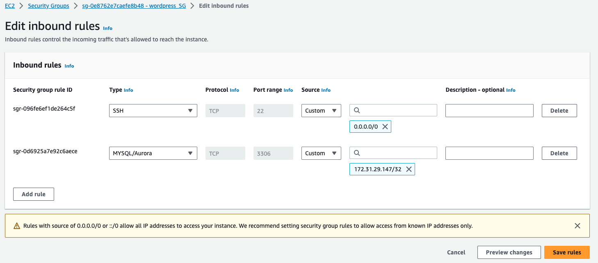
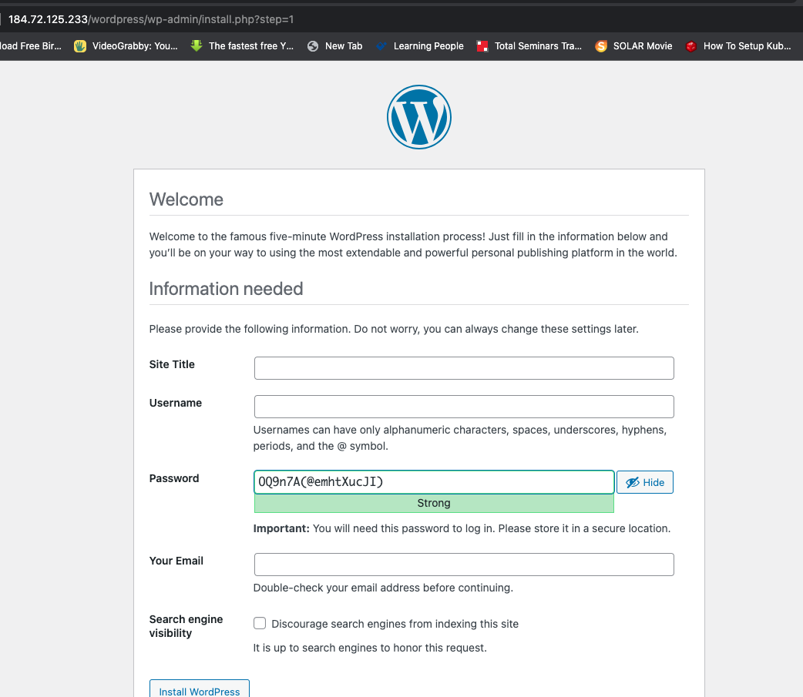

# Implementing Wordpress Website with Logical Volume Management (LVM) Storage Management

### Task
In this project, will be deploying a website solution using Wordpress with a LVM storage management, and will be using MySQL as the backend database. 

### Goal
The focus of this project is to give a practical experience on working with disks, partitions and volumes. This is also to solidify my skills on web and database deployment. 

This project showcases **Three-tier Architecture** while ensuring the disks used to store files on the Linux servers are adequately partitioned and managed through programs such as `gdisk` and `LVM` respectively.

*The **Three-tier Architecture** includes:*
- A Laptop or PC to serve as a client
- EC2 instance to install Wordpress as the webserver
- EC2 instance to serve as a database Server 

*Note*:
Used a `Redhat` OS for all the EC2 instances on this project.

## Implementation
1. Launched an EC2 instance running on a `Redhat` OS

- Created 3 volumes of 10Gb each on the same AZ as the instance (`us-east-1d`)

2. Attached the 3 volumes one after the other to the EC2 instance (webserver)

- SSH into the instance using termius as my SSH client.

3. Used the command `lsblk` to inspect what block devices are attached to the server.

All the devices in Linux resides in /dev/ directory. Inspected the volumes using `ls /dev/` to ensure all 3 newly created devices are there.

4. Used `df -h` command to see all mounts and free space on the instance.

5. Used `gdisk` utility to create a single partition on each of the 3 disks using the command
>
                 sudo gdisk /dev/disk-name

- Replaced the disk-name with `xvdf`, `xvdg`, `xvdh`. 
- Repeated this process for all 3 volumes

Used `lsblk` utility to view the newly configured partition on the 3 disks.

6. Installed `lvm2` package using 
- `sudo yum install lvm2`
- Ran `sudo lvmdiskscan` command to check for available partitions.

7. Used `pvcreate` utility to mark each of the 3 disks as physical volumes (PVs) to be used by `LVM` using the command:

>
    sudo pvcreate /dev/xvdf1
    sudo pvcreate /dev/xvdg1
    sudo pvcreate /dev/xvdh1

8. Verified the physical volumes was created successfully running the command `sudo pvs`

9. Used `vgcreate` utility to add all 3 PVs to a volume group (VG). Named the VG `webdata-vg`, using the command:
>
    sudo vgcreate webdata-vg /dev/xvdh1 /dev/xvdg1 /dev/xvdf1

10. Verified the VG was created successfully using the command `sudo vgs`

11. Used `lvcreate` utility to create 2 logical volumes:
    >
        sudo lvcreate -n apps-lv -L 14G webdata-vg
        sudo lvcreate -n logs-lv -L 14G webdata-vg

- `apps-lv` uses half of the PV size (to store website data)
- `logs-lv` uses the remaining half of the PV space (to store data logs)

12. Verified the Logical Volume has been created successfully using `sudo lvs` 

13. Verified the entire setup using 
- `sudo vgdisplay -v #view complete setup - VG, PV, and LV
sudo lsblk`

14. Used `mkfs.ext4` to format the logical volumes with `ext4` filesystem with the command:
>
    sudo mkfs -t ext4 /dev/webdata-vg/apps-lv
    sudo mkfs -t ext4 /dev/webdata-vg/logs-lv

15. Created a `/var/www/html/` directory to store website files, using
>
             sudo mkdir -p /var/www/html

16. Created a `/home/recovery/logs` to store backup of log data using 
>
             sudo mkdir -p /home/recovery/logs

17. Mounted the `/var/www/html/` on `apps-lv` logical volume using:
>
    sudo mount /dev/webdata-vg/apps-lv /var/www/html/

18. Used `rsync` utility to backup all the files in the log directory `/var/log` into `/home/recovery/logs` as this is required before mounting the file system
>   
    sudo rsync -av /var/log/. /home/recovery/logs/

19. Mounted `/var/log` on the `logs-lv` logical volume using 
>
    sudo mount /dev/webdata-vg/logs-lv /var/log

*Note:
All the existing data on `/var/log` will be deleted. That is why step 15 above is very important.*

20. Restored log files back into `var/log` directory using:
>
    sudo rsync -av /home/recovery/logs/. /var/log

21. Updated `/etc/fstab` file so that the mount configuration will persist after a restart of the server. The UUID of the device was used to update the `/etc/fstab` file.

- To get the UUID, used the command `sudo blkid`

- Opened the `fstab` file using `sudo vim /etc/fstab`
- Updated the file in this format

22. Mounted the configuration using 
- `sudo mount -a` 
- Reloaded the daemon using `sudo systemctl daemon-reload`

- Checked for syntax error on the updated `fstab` file using `sudo findmnt --verify`

23. Verified the setup by running `df -h`

## Installing Wordpress and Configuring to use MySQL Database

1. Launched a second RedHat EC2 instance that serves as the `DB Server`.

Repeated all the steps above, from Step 1 to 23 to prepare the DB server and mounting the 3 volumes. 

*Note: Steps 9, 11, 14, 15, 17, 19 and 21 of the above steps was replaced below.*

*Note*
### Step 9 replaced
- At the stage of creating a volume group (VG), named it `dbdata-vg` instead of `webdata-vg`. Using the command:
>
    sudo vgcreate dbdata-vg /dev/xvdh1 /dev/xvdg1 /dev/xvdf1

### Step 11 replaced

- Instead of the `apps-lv` created `db-lv` using the command:
>
    sudo lvcreate -n db-lv -L 14G dbdata-vg
    sudo lvcreate -n logs-lv -L 14G dbdata-vg

### Step 14 replaced 
- Used the command
>
    sudo mkfs -t ext4 /dev/dbdata-vg/db-lv
    sudo mkfs -t ext4 /dev/dbdata-vg/logs-lv

### Step 15 replaced
- Created a directory `/db` using `sudo mkdir /db`  

### Step 17 replaced
- Mounted the `db-lv` to `/db` directory instead of `/var/www/html` using
>
    sudo mount /dev/dbdata-vg/db-lv /db

### Step 19 replaced
- Mounted `/var/log` on the `logs-lv` logical volume using:
> 
    sudo mount /dev/dbdata-vg/logs-lv /var/log

### Step 21 replaced
- Used this format

2. Verified the setup using `df -h`

### Updating and installing Wordpress on the webserver EC2
3. Updated the webserver using `sudo yum update -y`
- Installed wget, Apache and its dependencies using
>
    sudo yum -y install wget httpd php php-mysqlnd php-fpm php-json

- Started and enabled Apache using
>
    sudo systemctl start httpd
    sudo systemctl enable httpd

4. Installed PHP and its dependencies
>
    - sudo yum install https://dl.fedoraproject.org/pub/epel/epel-release-latest-9.noarch.rpm
    - sudo yum install yum-utils http://rpms.remirepo.net/enterprise/remi-release-9.rpm
    - sudo yum module list php
    - sudo yum module reset php
    - sudo yum module enable php:remi-7.4
    - sudo yum install php php-opcache php-gd php-curl php-mysqlnd
    - sudo systemctl start php-fpm
    - sudo systemctl enable php-fpm
    - sudo setsebool -P httpd_execmem 1
*Note the version of RHEL OS version of the Instance is 9.2.0, hence why the version of php repo 9 as well*

5. Restarted Apache `sudo systemctl restart httpd`
6. Downloaded Wordpress and copied wordpress to `/var/www/html`
>
    - mkdir wordpress
    - cd   wordpress
    - sudo wget http://wordpress.org/latest.tar.gz
    - sudo tar xzvf latest.tar.gz
    - sudo rm -rf latest.tar.gz
    - sudo cp wordpress/wp-config-sample.php wordpress/wp-config.php
    - sudo cp -R wordpress /var/www/html/

7. Configured SELinux Policies (Security-Enhanced Linux) using:
>
    sudo chown -R apache:apache /var/www/html/wordpress
    sudo chcon -t httpd_sys_rw_content_t /var/www/html/wordpress -R
    sudo setsebool -P httpd_can_network_connect=1

### Configuring DB to work with Wordpress.
1. On the DB Server installed `MySQL`
>
    sudo yum update -y
    sudo yum install mysql-server -y
- Verified the service using `sudo systemctl status mysqld`

- Started and enabled the service using 
>
    sudo systemctl restart mysqld
    sudo systemctl enable mysqld 

2. Created a Database with a User using:
>
    sudo mysql
    CREATE DATABASE wordpress;
    CREATE USER `myuser`@`<Web-Server-Private-IP-Address>` IDENTIFIED BY 'mypass';
    GRANT ALL ON wordpress.* TO 'myuser'@'<Web-Server-Private-IP-Address>';
    FLUSH PRIVILEGES;
    SHOW DATABASES;
    exit

3. Configured WordPress to connect to remote database.
- On the security group, opened a port 3306 on the DB Server of the EC2 instance. Allowed access to only the IP address of the webserver for extra security.

4. Installed MySQL client on the Webserver using `sudo yum install mysql`
- Tested it using
>
    sudo mysql -u myuser -p -h <DB-Server-Private-IP-address>

- Verified the database using `SHOW DATABASES;` 

5. On the webserver, edited the wordpress configuration file using:
>
    sudo vim /var/www/html/wordpress/wp-config.php

6. Changed permission and configuration so Apache can use Wordpress.
- Gave permission using `sudo chmod -R 755 /var/www/html/wordpress`

7. Accessed the wordpress page on the browser using `<web-server-phublic-IP-address>/wordpress`

## Project completed !!!